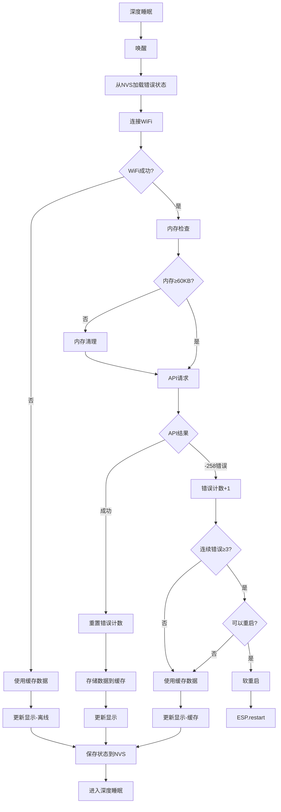

# 设计文档

## 🎯 核心问题定义

**主要问题**：`api.openweathermap.org/data/2.5/forecast` 返回 **-258 错误**（反序列化输入不完整）

**根本原因**：
1. **5天预报API返回大量数据**：~25KB，40个数据点（5天×8个3小时间隔）
2. **ESP32内存不足以解析大型JSON响应**：堆内存不够分配解析所需的缓冲区
3. **内存碎片化导致连续失败**：大型JSON解析后内存碎片严重
4. **一旦失败，内存状态损坏**：需要重启才能恢复正常

## 📋 技术方案整体评估

### ✅ 核心解决策略
1. **内存预检查**：API调用前确保有足够内存（≥60KB）
2. **响应大小限制**：限制响应大小≤25KB，防止过大响应
3. **深度睡眠模式错误检测**：跨睡眠周期持久化错误状态
4. **软重启机制**：连续3次-258错误后自动重启清理内存
5. **缓存回退**：API失败时使用NVS缓存的历史数据

### 🔄 深度睡眠模式下的工作流程



## 核心组件设计

### 1. 深度睡眠错误管理器 (DeepSleepErrorManager)

**目的**：跨深度睡眠周期管理-258错误状态

```cpp
class DeepSleepErrorManager {
private:
    struct ErrorState {
        int consecutiveErrors;      // 连续错误次数
        time_t lastErrorTime;       // 最后错误时间
        time_t lastRestartTime;     // 最后重启时间
        int totalRestarts;          // 总重启次数
    };
    
    ErrorState errorState;
    static const int MAX_CONSECUTIVE_ERRORS = 3;
    static const int MIN_RESTART_INTERVAL = 1800; // 30分钟
    
public:
    void initialize();                              // 启动时从NVS加载状态
    bool handleApiResult(int apiResult);           // 处理API结果，返回是否需要重启
    void recordSuccess();                          // 记录API成功
    void performSoftRestart();                     // 执行软重启
    
private:
    void loadErrorState();                         // 从NVS加载错误状态
    void saveErrorState();                         // 保存错误状态到NVS
    bool shouldTriggerRestart();                   // 检查是否应该触发重启
};
```

### 2. 简单缓存管理器 (SimpleForecastCache)

**目的**：NVS持久化缓存，API失败时提供回退数据

```cpp
class SimpleForecastCache {
private:
    static const char* CACHE_NAMESPACE = "forecast";
    static const char* DATA_KEY = "data";
    static const char* META_KEY = "meta";
    
    struct CacheMetadata {
        time_t cacheTime;           // 缓存时间
        bool isValid;               // 缓存是否有效
        size_t dataSize;            // 数据大小
        uint32_t checksum;          // 数据校验和
    };
    
public:
    bool storeForecastData(const owm_resp_onecall_t& data);    // 存储预报数据
    bool loadForecastData(owm_resp_onecall_t& data);           // 加载预报数据
    bool hasCachedData();                                      // 检查是否有缓存
    time_t getCacheAge();                                      // 获取缓存年龄
    
private:
    uint32_t calculateChecksum(const void* data, size_t size); // 计算校验和
    bool validateCache(const CacheMetadata& meta);            // 验证缓存有效性
};
```

### 3. 内存检查器 (MemoryChecker)

**目的**：API调用前检查和清理内存

```cpp
class MemoryChecker {
private:
    static const size_t MIN_REQUIRED_HEAP = 60000;  // 60KB最小堆内存
    static const float FRAGMENTATION_THRESHOLD = 0.7; // 碎片化阈值
    
public:
    bool checkMemoryBeforeApiCall();               // API调用前内存检查
    void performMemoryCleanup();                   // 执行内存清理
    float getMemoryFragmentation();                // 获取内存碎片化程度
    
private:
    void releaseDisplayBuffers();                  // 释放显示缓冲区
    void forceGarbageCollection();                 // 强制垃圾回收
};
```

## 主循环集成

### 完整的主循环实现

```cpp
// 全局变量
DeepSleepErrorManager errorManager;
SimpleForecastCache cache;
MemoryChecker memoryChecker;

void setup() {
    Serial.begin(115200);
    
    // 初始化错误管理器（从NVS加载状态）
    errorManager.initialize();
    
    // 其他初始化...
}

void loop() {
    // 1. 连接WiFi
    wl_status_t wifiStatus = startWiFi(wifiRSSI);
    
    if (wifiStatus != WL_CONNECTED) {
        LOG_ERROR("WiFi连接失败，使用缓存数据");
        handleOfflineMode();
        goToDeepSleep();
        return;
    }
    
    // 2. 同步时间
    if (!waitForSNTPSync(&timeInfo)) {
        LOG_ERROR("时间同步失败");
        handleOfflineMode();
        goToDeepSleep();
        return;
    }
    
    // 3. 内存检查
    if (!memoryChecker.checkMemoryBeforeApiCall()) {
        LOG_ERROR("内存不足，使用缓存数据");
        handleMemoryInsufficientMode();
        goToDeepSleep();
        return;
    }
    
    // 4. 执行API调用
    int apiResult = getOWMonecallWithChecks(client, owm_onecall);
    
    // 5. 处理API结果（可能触发重启）
    bool willRestart = errorManager.handleApiResult(apiResult);
    
    if (!willRestart) {
        // 正常流程：更新显示并睡眠
        if (apiResult == HTTP_CODE_OK) {
            // API成功，存储缓存
            cache.storeForecastData(owm_onecall);
            updateDisplay();
        } else {
            // API失败，使用缓存
            if (cache.loadForecastData(owm_onecall)) {
                updateDisplay("使用缓存数据");
            } else {
                updateDisplay("无可用数据");
            }
        }
        
        // 断开WiFi并进入深度睡眠
        killWiFi();
        goToDeepSleep();
    }
    
    // 注意：如果willRestart为true，程序不会到达这里
}

// 增强的API调用函数
int getOWMonecallWithChecks(WiFiClientSecure &client, owm_resp_onecall_t &r) {
    // 增加超时到60秒
    HTTPClient http;
    http.setTimeout(60000);
    http.setConnectTimeout(60000);
    
    String uri = "/data/2.5/forecast?lat=" + LAT + "&lon=" + LON +
                 "&units=standard&lang=" + OWM_LANG + "&appid=" + OWM_APIKEY;
    
    http.begin(client, OWM_ENDPOINT, OWM_PORT, uri);
    int httpCode = http.GET();
    
    if (httpCode == HTTP_CODE_OK) {
        int responseSize = http.getSize();
        
        // 检查响应大小
        if (responseSize > 25000) {
            LOG_ERROR("响应过大: " + String(responseSize) + " 字节");
            http.end();
            return -1001; // 自定义错误码：响应过大
        }
        
        // 再次检查内存
        if (ESP.getFreeHeap() < 60000) {
            LOG_ERROR("解析前内存不足: " + String(ESP.getFreeHeap()) + " 字节");
            http.end();
            return -1002; // 自定义错误码：内存不足
        }
        
        // 正常解析
        DeserializationError error = deserializeOneCall(http.getStream(), r);
        if (error) {
            LOG_ERROR("JSON解析失败: " + String(error.c_str()));
            http.end();
            return -258; // 反序列化失败
        }
        
        LOG_INFO("API调用成功，响应大小: " + String(responseSize) + " 字节");
    }
    
    http.end();
    return httpCode;
}

void handleOfflineMode() {
    if (cache.loadForecastData(owm_onecall)) {
        updateDisplay("离线模式 - 使用缓存");
    } else {
        updateDisplay("离线模式 - 无数据");
    }
}

void handleMemoryInsufficientMode() {
    if (cache.loadForecastData(owm_onecall)) {
        updateDisplay("内存不足 - 使用缓存");
    } else {
        updateDisplay("内存不足 - 无数据");
    }
}
```

## 配置参数

### 关键配置常量

```cpp
// 错误检测配置
static const int MAX_CONSECUTIVE_ERRORS = 3;           // 触发软重启的连续错误次数
static const int MIN_RESTART_INTERVAL = 1800;         // 30分钟最小重启间隔
static const int MAX_RESTARTS_PER_DAY = 8;            // 每天最大重启次数

// API调用配置
static const unsigned long FORECAST_HTTP_TIMEOUT = 60000;      // 60秒HTTP超时
static const size_t FORECAST_RESPONSE_SIZE_LIMIT = 25000;      // 25KB响应大小限制
static const size_t FORECAST_MIN_HEAP_REQUIRED = 60000;        // 60KB最小堆内存要求

// 缓存配置
static const unsigned long CACHE_VALID_HOURS = 6;              // 6小时缓存有效期
static const unsigned long CACHE_MAX_AGE_HOURS = 24;           // 24小时缓存最大年龄

// 深度睡眠配置
static const int NORMAL_SLEEP_DURATION = 30;                   // 30分钟正常睡眠
static const int ERROR_SLEEP_DURATION = 15;                    // 15分钟错误后睡眠

// 内存管理配置
static const float MEMORY_FRAGMENTATION_THRESHOLD = 0.7;       // 内存碎片化阈值
```

### NVS存储结构

```cpp
// 错误状态存储
struct ErrorState {
    int consecutiveErrors;      // 连续错误次数
    time_t lastErrorTime;       // 最后错误时间
    time_t lastRestartTime;     // 最后重启时间
    int totalRestarts;          // 总重启次数
};

// 缓存元数据
struct CacheMetadata {
    time_t cacheTime;           // 缓存时间
    bool isValid;               // 缓存是否有效
    size_t dataSize;            // 数据大小
    uint32_t checksum;          // 数据校验和
};

// NVS命名空间
static const char* ERROR_NAMESPACE = "error_mgr";
static const char* CACHE_NAMESPACE = "forecast";
static const char* RESTART_NAMESPACE = "restart_info";
```

## 预期效果和成功指标

### 🎯 成功指标
1. **-258错误发生率** < 5%（通过内存检查和响应限制）
2. **连续错误自动恢复率** > 95%（通过软重启机制）
3. **缓存命中率** > 80%（API失败时使用缓存）
4. **软重启成功率** > 95%（重启后能正常工作）
5. **用户体验连续性** 100%（始终有数据显示）

### 📊 预期效果
- **直接解决-258错误**：通过内存管理和响应限制
- **自动恢复能力**：软重启机制解决连续错误
- **用户体验**：缓存确保显示连续性
- **电池友好**：不影响现有深度睡眠机制
- **实施简单**：最小化复杂度，快速见效

### 🛡️ 风险控制
1. **重启频率限制**：30分钟间隔，每天最多8次
2. **缓存回退**：确保始终有数据可显示
3. **状态持久化**：NVS确保跨睡眠周期状态保持
4. **内存保护**：预检查防止内存不足导致的崩溃

