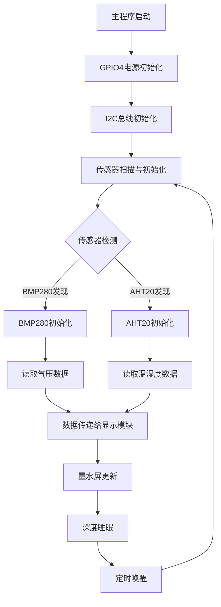
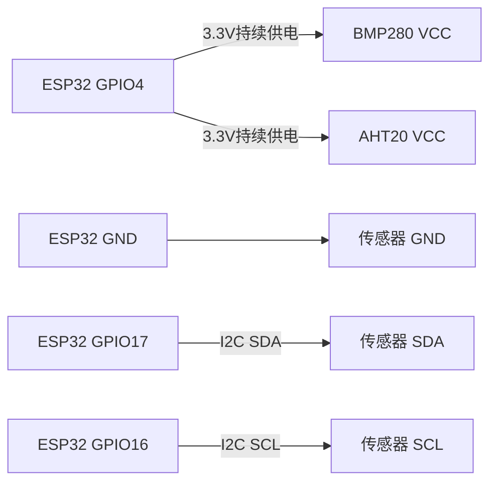
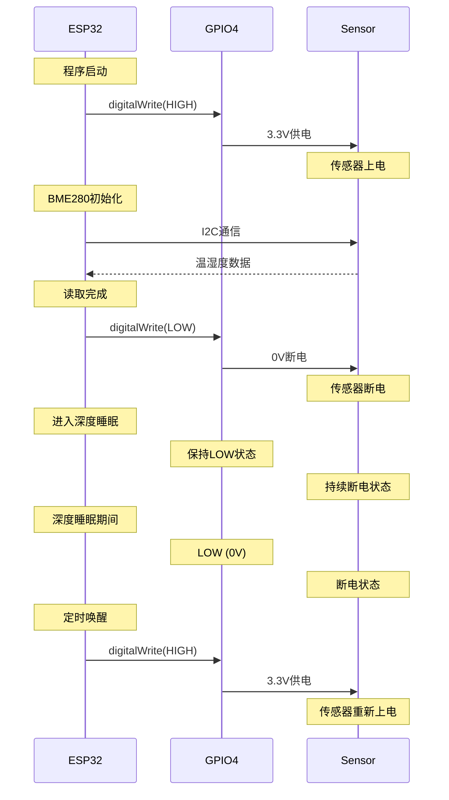

# 传感器集成设计文档

## 概述

本设计文档描述了如何将子工程中成功运行的BMP280和AHT20双传感器功能集成到主工程中，解决电源管理问题，并实现数据到墨水屏的正确传递。

## 架构

### 系统架构图



### 电源管理架构



## 组件和接口

### 1. 电源管理模块

#### 接口定义
```cpp
class SensorPowerManager {
public:
    void initializePower();
    void maintainPower();
    bool isPowerOn();
    float getPowerVoltage();
};
```

#### 实现要点
- GPIO4在程序启动时设置为HIGH并保持
- 移除原有的电源关闭逻辑
- 提供电源状态查询接口

### 2. 传感器管理模块

#### 接口定义
```cpp
class DualSensorManager {
private:
    TwoWire* i2cBus;
    Adafruit_BMP280* bmp280;
    Adafruit_AHTX0* aht20;
    bool bmp280Available;
    bool aht20Available;
    
public:
    bool initialize();
    bool scanDevices();
    SensorData readAllSensors();
    bool isBMP280Available();
    bool isAHT20Available();
};

struct SensorData {
    float bmp280_temperature;
    float bmp280_pressure;
    float aht20_temperature;
    float aht20_humidity;
    bool bmp280_valid;
    bool aht20_valid;
};
```

### 3. I2C总线管理

#### 配置参数
```cpp
const int I2C_SDA_PIN = 17;
const int I2C_SCL_PIN = 16;
const int I2C_FREQUENCY = 100000; // 100kHz
const uint8_t BMP280_ADDRESS = 0x77;
const uint8_t AHT20_ADDRESS = 0x38;
```

#### 总线初始化
```cpp
void initializeI2C() {
    Wire.begin(I2C_SDA_PIN, I2C_SCL_PIN, I2C_FREQUENCY);
    // 设置超时和重试机制
}
```

## 数据模型

### 传感器数据结构

```cpp
typedef struct {
    // BMP280数据
    float pressure_pa;      // 气压 (Pa)
    float pressure_hpa;     // 气压 (hPa)
    float bmp_temperature;  // BMP280温度 (°C)
    
    // AHT20数据
    float aht_temperature;  // AHT20温度 (°C)
    float humidity;         // 湿度 (%)
    
    // 状态标志
    bool bmp280_ok;
    bool aht20_ok;
    uint32_t timestamp;
} indoor_sensor_data_t;
```

### 显示数据映射

```cpp
// 原有变量映射
float inTemp = sensorData.aht_temperature;     // 室内温度 (AHT20)
float inHumidity = sensorData.humidity;        // 室内湿度 (AHT20)
float pressure = sensorData.pressure_hpa;      // 气压 (BMP280)
```

## 错误处理

### 传感器初始化失败处理

```cpp
enum SensorError {
    SENSOR_OK,
    SENSOR_POWER_FAIL,
    SENSOR_I2C_FAIL,
    SENSOR_BMP280_FAIL,
    SENSOR_AHT20_FAIL,
    SENSOR_READ_FAIL
};

class SensorErrorHandler {
public:
    void handleError(SensorError error);
    void setDefaultValues();
    void retryInitialization();
};
```

### 错误恢复策略

1. **电源问题**: 重新设置GPIO4为HIGH
2. **I2C通信失败**: 重新初始化I2C总线
3. **传感器无响应**: 使用默认值并标记错误
4. **数据读取失败**: 重试3次，失败后使用上次有效值

## 测试策略

### 单元测试

1. **电源管理测试**
   - 验证GPIO4电平保持3.3V
   - 验证电源不会被意外关闭

2. **传感器通信测试**
   - I2C设备扫描测试
   - 传感器初始化测试
   - 数据读取准确性测试

3. **集成测试**
   - 双传感器同时工作测试
   - 长时间稳定性测试
   - 错误恢复测试

### 调试功能

```cpp
#if DEBUG_SENSORS
void printSensorDebugInfo() {
    Serial.println("=== 传感器调试信息 ===");
    Serial.printf("GPIO4电平: %.1fV\n", digitalRead(4) ? 3.3 : 0.0);
    Serial.printf("I2C总线状态: %s\n", Wire.busy() ? "忙碌" : "空闲");
    // ... 更多调试信息
}
#endif
```

## 实现计划

### 阶段1: 电源管理修复
1. 修改main.cpp中的GPIO4控制逻辑
2. 移除电源关闭代码
3. 验证GPIO4持续高电平

### 阶段2: 传感器模块集成
1. 创建DualSensorManager类
2. 集成BMP280和AHT20库
3. 实现I2C扫描功能

### 阶段3: 数据流集成
1. 修改数据读取逻辑
2. 更新显示数据映射
3. 测试墨水屏显示

### 阶段4: 代码清理
1. 移除GPIO测试代码
2. 清理未使用的函数
3. 优化代码结构

### 阶段5: 测试验证
1. 功能测试
2. 稳定性测试
3. 性能优化

## GPIO4深度睡眠状态分析

### 当前主工程GPIO4生命周期

#### 1. 程序启动时
```cpp
// 位置: src/main.cpp:410
pinMode(PIN_BME_PWR, OUTPUT);
digitalWrite(PIN_BME_PWR, HIGH);  // ✅ GPIO4设为高电平
```

#### 2. BME280读取完成后
```cpp
// 位置: src/main.cpp:448-452
if (!gpioTest.isTestActive()) {
    digitalWrite(PIN_BME_PWR, LOW);  // ❌ GPIO4设为低电平
    Serial.println("BME280电源已关闭 (正常模式)");
}
```

#### 3. 进入深度睡眠前
```cpp
// 位置: src/main.cpp:479
beginDeepSleep(startTime, &timeInfo);
```

**⚠️ 关键发现：beginDeepSleep函数中没有对GPIO4的特殊处理**

#### 4. 深度睡眠期间GPIO4状态
- **当前状态**: LOW (0V) - 传感器断电
- **ESP32深度睡眠特性**: GPIO状态在深度睡眠期间保持不变
- **问题**: 传感器在整个睡眠期间都处于断电状态

#### 5. 从深度睡眠唤醒后
```cpp
// ESP32重启，重新执行setup()函数
pinMode(PIN_BME_PWR, OUTPUT);
digitalWrite(PIN_BME_PWR, HIGH);  // ✅ GPIO4重新设为高电平
```

### GPIO4状态时序图



### 问题分析

#### 当前设计的问题
1. **传感器频繁上下电**: 每次读取后都断电，下次使用时重新上电
2. **初始化开销**: 每次上电后都需要重新初始化传感器
3. **数据稳定性**: 频繁的电源切换可能影响传感器稳定性
4. **功耗优化过度**: 为了节省微安级功耗而增加了复杂性

#### 深度睡眠期间GPIO4状态确认
- **确认**: GPIO4在深度睡眠期间确实是LOW电平 (0V)
- **确认**: 从深度睡眠唤醒后，程序重新执行setup()，GPIO4重新设为HIGH电平
- **影响**: 传感器在睡眠期间完全断电，唤醒后需要重新初始化

### 优化方案

#### 方案1: 持续供电 (推荐)
```cpp
// 移除电源关闭逻辑
// digitalWrite(PIN_BME_PWR, LOW);  // 删除这行

// 保持GPIO4持续高电平
// 传感器在深度睡眠期间也保持供电
```

**优势**:
- 传感器状态稳定
- 无需重复初始化
- 代码逻辑简化
- 数据读取更可靠

**功耗影响**:
- BMP280静态功耗: ~2.1μA
- AHT20静态功耗: ~0.25μA
- 总增加功耗: ~2.35μA (相对于深度睡眠的11μA，增加约21%)

#### 方案2: 智能电源管理
```cpp
void beginDeepSleep(unsigned long startTime, tm *timeInfo) {
    // 在深度睡眠前保持传感器电源
    // digitalWrite(PIN_BME_PWR, HIGH);  // 确保电源开启
    
    // 配置GPIO4在深度睡眠期间保持高电平
    gpio_hold_en(GPIO_NUM_4);
    
    esp_sleep_enable_timer_wakeup(sleepDuration * 1000000ULL);
    esp_deep_sleep_start();
}
```

## 关键修改点

### 1. main.cpp修改

```cpp
// 原有代码 (问题)
digitalWrite(PIN_BME_PWR, LOW);  // 这行导致传感器断电

// 修改后代码 (解决方案)
// 移除电源关闭逻辑，保持GPIO4持续高电平
// digitalWrite(PIN_BME_PWR, LOW);  // 注释掉或删除
```

### 2. 传感器初始化修改

```cpp
// 原有代码
#if defined(SENSOR_BME280)
  // 只支持BME280
#endif

// 修改后代码
// 支持BMP280 + AHT20双传感器
DualSensorManager sensorManager;
if (sensorManager.initialize()) {
    SensorData data = sensorManager.readAllSensors();
    // 使用数据
}
```

### 2. 深度睡眠GPIO状态管理

```cpp
// 新增: 深度睡眠前的GPIO状态保持
void beginDeepSleep(unsigned long startTime, tm *timeInfo) {
    // 确保传感器电源在深度睡眠期间保持开启
    digitalWrite(PIN_BME_PWR, HIGH);
    
    // 使用GPIO保持功能，确保深度睡眠期间GPIO4保持高电平
    gpio_hold_en(GPIO_NUM_4);
    
    // ... 原有的深度睡眠逻辑
    esp_deep_sleep_start();
}

// 新增: 唤醒后的GPIO状态恢复
void setup() {
    // 释放GPIO保持状态
    gpio_hold_dis(GPIO_NUM_4);
    
    // 确保GPIO4为高电平
    pinMode(PIN_BME_PWR, OUTPUT);
    digitalWrite(PIN_BME_PWR, HIGH);
    
    // ... 其他初始化代码
}
```

### 3. 显示数据更新

```cpp
// 原有代码
inTemp = bme.readTemperature();
inHumidity = bme.readHumidity();

// 修改后代码
SensorData sensorData = sensorManager.readAllSensors();
inTemp = sensorData.aht20_temperature;
inHumidity = sensorData.humidity;
// 新增气压数据
pressure = sensorData.pressure_hpa;
```

## 实施验证清单

### GPIO4状态验证
- [ ] 程序启动时GPIO4为HIGH (3.3V)
- [ ] BME280读取期间GPIO4保持HIGH
- [ ] 进入深度睡眠前GPIO4为HIGH
- [ ] 深度睡眠期间GPIO4保持HIGH (使用gpio_hold_en)
- [ ] 从深度睡眠唤醒后GPIO4仍为HIGH
- [ ] 传感器无需重新初始化即可正常工作

### 功耗影响评估
- [ ] 测量深度睡眠期间的总功耗
- [ ] 评估传感器持续供电的功耗增加
- [ ] 确认功耗增加在可接受范围内 (< 5μA)

### 稳定性测试
- [ ] 长时间运行测试 (24小时以上)
- [ ] 多次深度睡眠/唤醒循环测试
- [ ] 传感器数据准确性验证
- [ ] 系统稳定性确认

## 总结

通过详细分析主工程的GPIO4生命周期，确认了以下关键点：

1. **当前状态**: GPIO4在深度睡眠期间确实是LOW电平，传感器断电
2. **唤醒行为**: 从深度睡眠唤醒后，程序重新执行setup()，GPIO4重新设为HIGH
3. **问题根源**: BME280读取完成后的 `digitalWrite(PIN_BME_PWR, LOW)` 导致传感器断电
4. **解决方案**: 移除电源关闭逻辑，使用GPIO保持功能确保深度睡眠期间供电连续

这个设计确保了传感器能够稳定工作，数据能够正确传递给显示系统，同时保持了代码的整洁性和可维护性。通过GPIO保持功能，我们可以在深度睡眠期间维持传感器供电，避免频繁的上下电操作，提高系统的稳定性和可靠性。