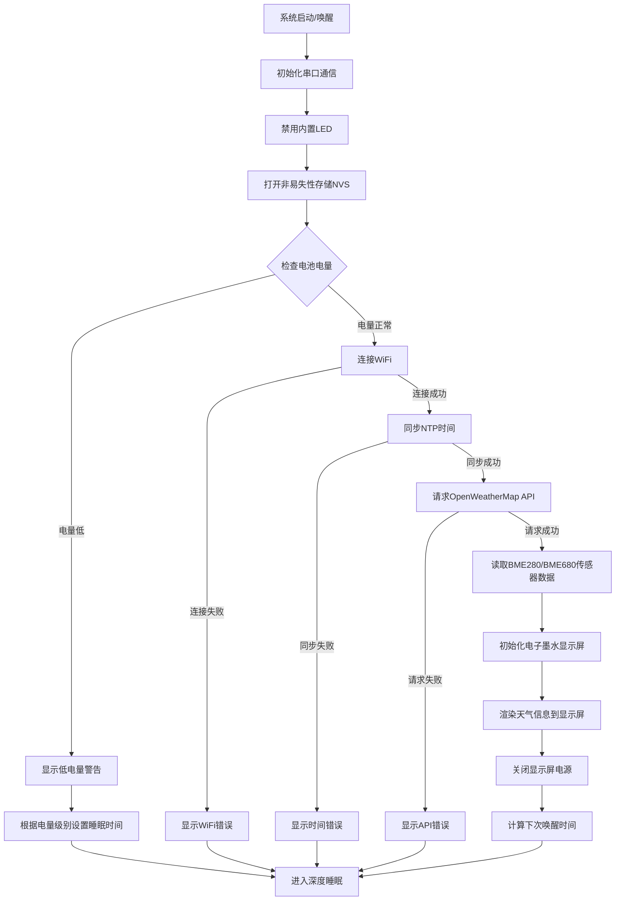
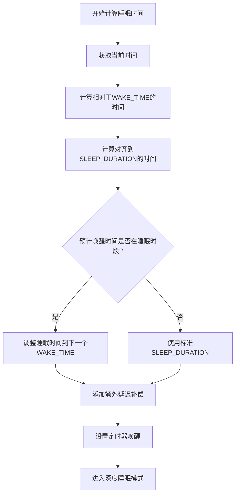
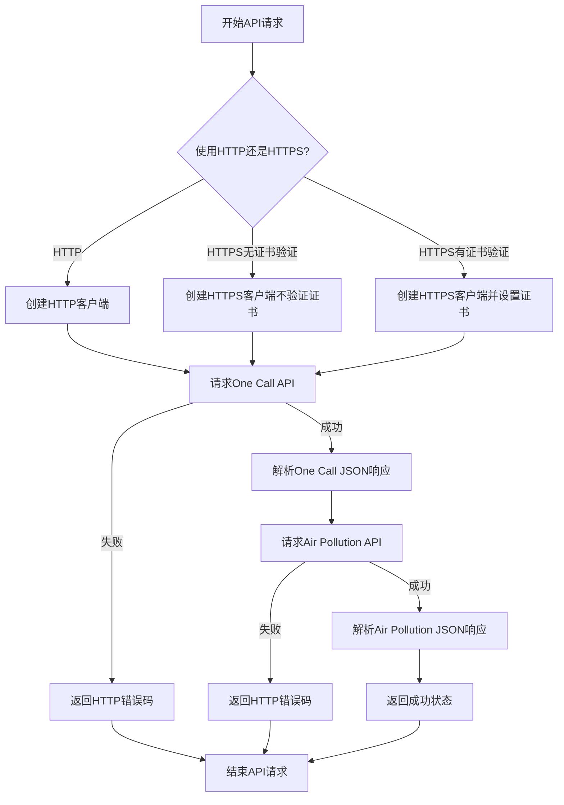
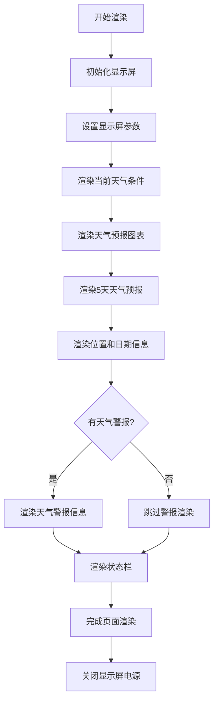
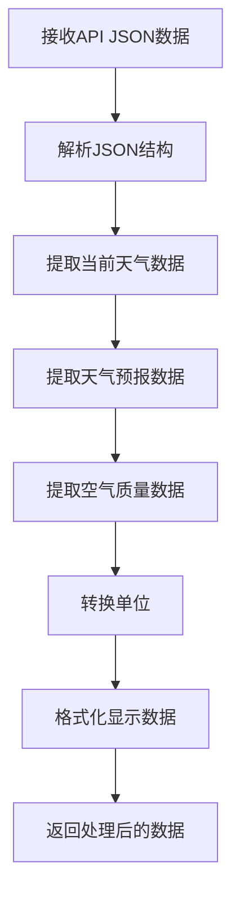
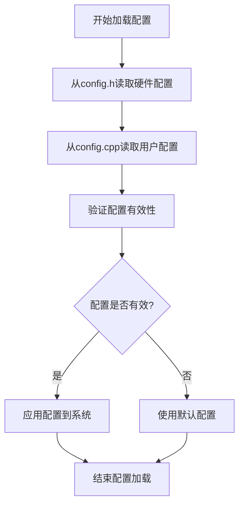
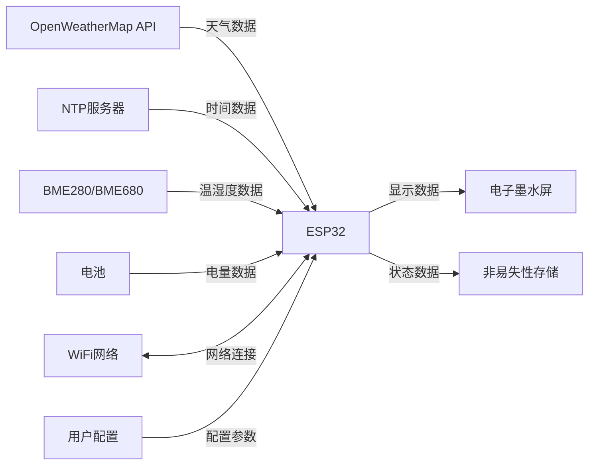

# ESP32 电子墨水屏天气显示器 - 技术框架知识库

## 项目概述

ESP32电子墨水屏天气显示器是一个低功耗的物联网设备，使用ESP32微控制器和7.5英寸电子墨水屏显示天气信息。项目支持两种主要开发板配置：`esp32dev`（官方ESP32-DevKitC开发板）和`dfrobot_firebeetle2_esp32e`（DFRobot FireBeetle 2 ESP32-E）。

## 硬件架构

### 支持的开发板

#### 1. ESP32-DevKitC (esp32dev)
- **官方开发板**：ESP32-DevKitC-V4
- **特点**：标准ESP32开发板，需要外部电池管理电路
- **引脚定义**：
  - LED_BUILTIN: GPIO2
  - 电池ADC: GPIO32 (A2)
  - 支持PSRAM

#### 2. DFRobot FireBeetle 2 ESP32-E (dfrobot_firebeetle2_esp32e)
- **特点**：集成电池管理、USB-C充电、低功耗设计
- **引脚定义**：
  - LED_BUILTIN: GPIO2
  - 电池ADC: A2
  - 内置充电和保护电路

### 硬件连接图

```
ESP32 微控制器
├── 电子墨水屏 (SPI接口)
│   ├── BUSY: GPIO25
│   ├── CS: GPIO15
│   ├── RST: GPIO26
│   ├── DC: GPIO27
│   ├── SCK: GPIO13
│   ├── MOSI: GPIO14
│   ├── MISO: GPIO12
│   └── PWR: GPIO26 (可选)
├── BME280/BME680传感器 (I2C接口)
│   ├── SDA: GPIO17
│   ├── SCL: GPIO16
│   └── PWR: GPIO4 (可选)
├── LED指示灯
│   └── LED1: GPIO2
└── 电池监控
    └── BAT_ADC: A2/GPIO32
```

### 支持的显示屏

| 型号 | 分辨率 | 颜色 | 刷新时间 |
|------|--------|------|----------|
| Waveshare 7.5" v2 | 800×480 | 黑/白 | ~2-3秒 |
| Waveshare 7.5" B | 800×480 | 红/黑/白 | ~15秒 |
| Waveshare 7.3" F | 800×480 | 7色 | ~30秒 |
| Good Display GDEY075T7 | 800×480 | 黑/白 | ~2-3秒 |

## 软件架构

### 分层架构

根据 `test/ESP32_E-Paper_Weather_Display_Architecture.md` 的系统架构图：

```
+-------------------------------------+
|            功能层                    |
+-------------------------------------+
| 天气数据获取 | 时间同步 | 低功耗管理 | 错误处理 |
+-------------------------------------+
              |
+-------------------------------------+
|            应用层                    |
+-------------------------------------+
| 配置管理 | API通信 | 数据处理 | 显示渲染 |
+-------------------------------------+
              |
+-------------------------------------+
|            驱动层                    |
+-------------------------------------+
| GxEPD2库 | WiFi库 | 传感器驱动 | 电源管理 |
+-------------------------------------+
              |
+-------------------------------------+
|            硬件层                    |
+-------------------------------------+
| ESP32微控制器 | 电子墨水屏 | BME280传感器 |
+-------------------------------------+
```

### 系统架构详解

#### 硬件层
- **ESP32微控制器**：FireBeetle 2 ESP32-E，具有低功耗设计、USB-C接口和电池管理功能
- **电子墨水显示屏**：支持多种型号，主要为7.5英寸800x480像素黑白屏幕
- **适配板**：DESPI-C02
- **传感器**：BME280，用于测量室内温度、湿度和气压
- **电池**：3.7V锂电池，JST-PH2.0接口

#### 驱动层
- **GxEPD2库**：电子墨水屏驱动库
- **WiFi库**：ESP32内置WiFi功能
- **传感器驱动**：BME280/BME680驱动库
- **电源管理**：深度睡眠和电池监控

#### 应用层
- **配置管理**：系统参数、API密钥、WiFi凭据管理
- **API通信**：与OpenWeatherMap API的HTTP/HTTPS通信
- **数据处理**：JSON数据解析和存储
- **显示渲染**：界面渲染和显示控制

#### 功能层
- **天气数据获取**：从API获取天气和空气质量数据
- **时间同步**：NTP时间同步
- **低功耗管理**：深度睡眠控制和电池监控
- **错误处理**：各种异常情况的处理和显示

### 核心模块

#### 1. 配置模块 (config.h/config.cpp)
- **职责**：系统参数配置和管理
- **主要配置**：
  - 硬件引脚定义
  - WiFi网络设置
  - API密钥和端点
  - 显示选项和单位
  - 电源管理参数

#### 2. API通信模块 (client_utils.cpp)
- **职责**：网络通信和数据获取
- **主要功能**：
  - WiFi连接管理
  - OpenWeatherMap API调用
  - NTP时间同步
  - HTTP/HTTPS通信

#### 3. 数据处理模块 (api_response.cpp)
- **职责**：JSON数据解析和存储
- **数据结构**：
  - 当前天气数据 (owm_current_t)
  - 小时预报数据 (owm_hourly_t)
  - 每日预报数据 (owm_daily_t)
  - 空气质量数据 (owm_resp_air_pollution_t)

#### 4. 显示渲染模块 (renderer.cpp, display_utils.cpp)
- **职责**：界面渲染和显示控制
- **渲染内容**：
  - 当前天气条件
  - 天气预报图表
  - 每日天气预报
  - 状态栏信息
  - 错误信息显示

#### 5. 电源管理模块 (main.cpp)
- **职责**：低功耗管理和电池监控
- **功能**：
  - 深度睡眠控制
  - 电池电量监测
  - 睡眠时间计算
  - 夜间节电模式

## 编译配置

### PlatformIO配置

```ini
[platformio]
default_envs = dfrobot_firebeetle2_esp32e

[env]
platform = espressif32 @ 6.10.0
framework = arduino
build_flags = 
  -DCORE_DEBUG_LEVEL=3
  -Wall 
  -std=gnu++17
lib_deps =
  adafruit/Adafruit BME280 Library @ 2.3.0
  adafruit/Adafruit GFX Library @ 1.11.9
  bblanchon/ArduinoJson @ 7.4.1
  zinggjm/GxEPD2 @ 1.6.4

[env:dfrobot_firebeetle2_esp32e]
board = dfrobot_firebeetle2_esp32e
board_build.f_cpu = 80000000L
build_flags = ${env.build_flags} -DDEBUG_LEVEL=5

[env:board_esp32dev]
board = esp32dev
build_flags = 
  ${env.build_flags}
  -DBOARD_HAS_PSRAM
  -DESP32
  -DLED_BUILTIN=2
  -DA2=32
```

### 编译差异

#### ESP32-DevKitC配置
- 使用标准ESP32开发板
- 需要定义PSRAM支持
- 电池ADC映射到GPIO32
- 需要外部电池管理电路

#### FireBeetle 2 ESP32-E配置
- 使用DFRobot专用板型
- 内置电池管理
- 优化的低功耗设计
- USB-C充电接口

## 系统流程

### 主要工作流程

根据 `ESP32_E-Paper_Weather_Display_Flowchart.md` 和 `test/ESP32_E-Paper_Weather_Display_Architecture.md` 的详细流程图，系统的完整工作流程如下：

#### 简化系统流程图

```
+----------------+     +----------------+     +----------------+
|  系统启动/唤醒  | --> |  初始化硬件组件  | --> |  检查电池电量  |
+----------------+     +----------------+     +----------------+
                                                     |
+----------------+     +----------------+     +----------------+
| 进入深度睡眠模式 | <-- |   渲染显示内容   | <-- |  获取传感器数据 |
+----------------+     +----------------+     +----------------+
                                                     ^
                                                     |
                       +----------------+     +----------------+
                       |   解析API数据   | <-- |  连接WiFi网络  |
                       +----------------+     +----------------+
                             ^                       |
                             |                       v
                       +----------------+     +----------------+
                       |  处理错误情况   | <-- |  API数据请求   |
                       +----------------+     +----------------+
```

#### 详细系统流程图



### 深度睡眠策略

根据流程图，深度睡眠计算遵循以下算法：



1. **睡眠时间计算**：
   - 基于SLEEP_DURATION配置（默认30分钟）
   - 考虑BED_TIME和WAKE_TIME设置
   - 对齐到配置的更新间隔
   - 添加延迟补偿以确保准确性

2. **功耗优化**：
   - 深度睡眠模式：~14μA
   - 刷新时功耗：~83mA
   - 预期续航：6-12个月（5000mAh电池）

3. **低电量处理策略**：
   - 低电量阈值检测
   - 分级睡眠时间调整（30分钟/120分钟）
   - 极低电量时进入休眠模式（需手动重置）

## API集成

### OpenWeatherMap API

#### 1. Current Weather API
- **端点**：`/data/2.5/weather`
- **用途**：获取当前天气数据
- **参数**：lat, lon, units, lang, appid

#### 2. One Call API 3.0
- **端点**：`/data/3.0/onecall`
- **用途**：获取天气预报和历史数据
- **参数**：lat, lon, exclude, units, lang, appid

#### 3. Air Pollution API
- **端点**：`/data/2.5/air_pollution`
- **用途**：获取空气质量数据
- **参数**：lat, lon, appid

### NTP时间同步
- **服务器**：pool.ntp.org, time.nist.gov
- **协议**：标准NTP协议
- **超时**：20秒

## 错误处理

### 错误处理流程

根据流程图，系统的错误处理遵循统一的处理模式：

```mermaid
flowchart TD
    A[检测错误] --> B{错误类型?}
    
    B -->|WiFi连接错误| C[显示WiFi错误图标]
    C --> D[显示"WiFi连接失败"或"SSID不可用"]
    
    B -->|API错误| E[显示API错误图标]
    E --> F[显示HTTP错误代码和描述]
    
    B -->|时间同步错误| G[显示时间错误图标]
    G --> H[显示"时间同步失败"]
    
    B -->|低电量错误| I[显示电池警告图标]
    I --> J[显示"电池电量低"]
    
    D --> K[设置下次尝试时间]
    F --> K
    H --> K
    J --> K
    
    K --> L[进入深度睡眠]
```

### 错误类型详解

1. **低电量错误**
   - 触发条件：电池电压 < LOW_BATTERY_VOLTAGE (3.20V)
   - 显示：电池警告图标和文字
   - 处理策略：
     - 首次检测：在NVS中标记低电量状态并显示警告
     - 后续检测：跳过显示更新
     - 极低电量：进入休眠模式（需手动重置）
     - 很低电量：设置较长睡眠间隔（120分钟）
     - 标准低电量：设置标准低电量睡眠间隔（30分钟）

2. **WiFi连接错误**
   - 触发条件：WiFi连接失败或超时
   - 显示：WiFi错误图标和状态信息
   - 错误信息：
     - "WiFi Connection Failed"：密码错误
     - "SSID Not Available"：SSID错误或超出范围
   - 处理：显示错误后进入睡眠模式

3. **API错误**
   - 触发条件：HTTP请求失败或返回错误状态码
   - 显示：云端错误图标和错误代码
   - 错误代码：
     - 正数：HTTP响应状态码
     - 负数或0：客户端(ESP32)错误
   - 处理：显示错误信息后进入睡眠模式

4. **时间同步错误**
   - 触发条件：NTP同步失败或超时
   - 显示：时钟错误图标和错误信息
   - 处理：使用本地时间或进入睡眠模式

## 开发环境

### 必需工具
- **IDE**：Visual Studio Code
- **插件**：PlatformIO IDE
- **编译器**：ESP32 Arduino Core
- **调试**：串口监视器 (115200波特率)

### 开发流程
1. 克隆项目代码
2. 配置secrets.h文件（WiFi凭据、API密钥）
3. 根据硬件选择合适的环境配置
4. 编译并上传到ESP32
5. 通过串口监视器调试

### 测试环境配置

根据 `test_commands.txt` 和环境配置文档，推荐的测试流程：

#### 虚拟环境方式
```bash
# 激活虚拟环境
source /Users/sanm/Documents/GitHub/esp32-weather-epd/.venv/bin/activate

# 进入测试目录
cd test

# 编译测试代码
platformio run

# 编译并上传（指定串口）
platformio run --target upload --upload-port /dev/tty.wchusbserial58FD0147681

# 退出虚拟环境
deactivate
```

#### 直接调用方式
```bash
# 进入测试目录
cd /Users/sanm/Documents/GitHub/esp32-weather-epd/test

# 仅编译测试代码
/Users/sanm/Documents/GitHub/esp32-weather-epd/.venv/bin/platformio run

# 编译并上传到开发板
/Users/sanm/Documents/GitHub/esp32-weather-epd/.venv/bin/platformio run --target upload --upload-port /dev/tty.wchusbserial58FD0147681

# 自动检测并上传
/Users/sanm/Documents/GitHub/esp32-weather-epd/.venv/bin/platformio run --target upload
```

### 环境配置问题解决

根据 `环境配置问题解决方案.md`，常见配置问题及解决方案：

#### 1. 敏感信息分离
- 创建 `include/secrets.h` 文件存储WiFi凭据和API密钥
- 在 `.gitignore` 中添加 `/include/secrets.h`
- 在代码中使用宏定义引用敏感信息

#### 2. 头文件引用路径优化
- 在 `platformio.ini` 中添加全局包含路径：
```ini
build_flags = 
  -Wall 
  -std=gnu++17
  -I${PROJECT_DIR}/include
  -I${PROJECT_DIR}/src
```

#### 3. IDE配置优化
- 创建 `.vscode/c_cpp_properties.json` 配置IntelliSense
- 创建 `.vscode/settings.json` 配置编辑器行为
- 重建IntelliSense索引以启用"转至定义"功能

## 配置选项

根据 `test/ESP32_E-Paper_Weather_Display_Architecture.md`，系统提供了丰富的配置选项：

### 硬件配置
- **支持不同型号的电子墨水屏**：7.5英寸黑白屏、三色屏、七色屏
- **传感器选择**：BME280/BME680传感器支持
- **开发板适配**：ESP32-DevKitC和FireBeetle 2 ESP32-E

### 显示配置
- **语言支持**：多语言本地化
- **单位制**：公制/英制单位系统
- **时间格式**：12/24小时制
- **温度单位**：摄氏度/华氏度/开尔文
- **字体选择**：多种字体选项
- **图标精度**：天气图标显示精度
- **显示内容控制**：可选择显示的信息项

### 电源管理配置
- **更新频率**：可配置睡眠间隔（默认30分钟）
- **夜间模式**：设置睡眠时段（BED_TIME和WAKE_TIME）
- **电池阈值**：可配置低电量警告级别
- **睡眠时间**：SLEEP_DURATION配置
- **低电量处理**：分级电量管理策略

### 网络配置
- **WiFi设置**：SSID和密码配置
- **超时设置**：连接和请求超时时间
- **API配置**：OpenWeatherMap API密钥和端点设置
- **NTP服务器**：时间同步服务器配置

### 本地化配置
- **多语言支持**：界面语言本地化
- **时间格式**：日期和时间显示格式
- **地理位置**：纬度和经度设置
- **城市名称**：显示的城市名称配置

## 性能指标

### 响应时间
- **唤醒到显示**：约15秒
- **显示刷新**：2-3秒（黑白屏）
- **WiFi连接**：5-10秒

### 内存使用
- **RAM使用**：约200-300KB（总520KB）
- **Flash使用**：约1-2MB（总4MB）
- **JSON缓冲区**：128KB（天气数据）

### 电池续航
- **理论续航**：6-12个月
- **实际测试**：取决于更新频率和环境条件
- **优化建议**：30分钟更新间隔，启用夜间模式

## 扩展性

### 硬件扩展
- 支持不同尺寸的电子墨水屏
- 支持BME280和BME680传感器
- 可添加其他I2C/SPI设备

### 软件扩展
- 支持其他天气API
- 可添加更多传感器类型
- 支持OTA固件更新

## 调试指南

### 调试级别
- **DEBUG_LEVEL 0**：基本信息
- **DEBUG_LEVEL 1**：详细信息
- **DEBUG_LEVEL 2**：API响应数据

### 传感器数据获取调试

根据流程图，传感器数据获取的详细流程：

```mermaid
flowchart TD
    A[开始读取传感器] --> B[设置BME电源引脚为输出]
    B --> C[打开BME电源]
    C --> D[初始化I2C通信]
    D --> E{传感器类型?}
    
    E -->|BME280| F[初始化BME280]
    E -->|BME680| G[初始化BME680]
    
    F --> H{初始化成功?}
    G --> H
    
    H -->|是| I[读取温度数据]
    H -->|否| J[记录"传感器未找到"错误]
    
    I --> K[读取湿度数据]
    K --> L{读取值是否有效?}
    
    L -->|是| M[记录成功状态]
    L -->|否| N[记录"读取失败"错误]
    
    J --> O[关闭BME电源]
    M --> O
    N --> O
    
    O --> P[结束传感器读取]
```

### API数据获取调试

API请求的详细流程：



### 显示渲染调试

显示渲染的详细流程：



### 常见问题排查

1. **显示不更新**：
   - 检查电池电量（参考低电量处理流程）
   - 验证WiFi连接状态
   - 检查API请求是否成功

2. **API错误401**：
   - 验证API密钥和订阅状态
   - 检查One Call API 3.0订阅配置
   - 确认API调用频率限制

3. **时间同步失败**：
   - 检查网络连接和NTP服务器
   - 验证NTP_TIMEOUT设置（默认20秒）
   - 尝试不同的NTP服务器

4. **传感器读取失败**：
   - 检查I2C连接（SDA: GPIO17, SCL: GPIO16）
   - 验证传感器电源控制（PWR: GPIO4）
   - 确认传感器地址（0x76或0x77）

### 调试工具
- **串口监视器**：实时查看系统日志（115200波特率）
- **LED指示灯**：显示系统工作状态（GPIO2）
- **错误显示**：在屏幕上显示错误信息和图标
- **NVS存储**：持久化低电量状态等信息

## 部署注意事项

### 硬件组装
1. 确保所有连接正确且牢固
2. 检查电源极性（特别是JST连接器）
3. 设置适配板开关到正确位置：
   - DESPI-C02适配板：RESE开关设置到0.47位置
   - Waveshare E-Paper HAT：Display Config设置到B，Interface Config设置到0
4. 测试所有功能后再封装

### 软件配置

#### 环境配置快速脚本
根据 `快速环境配置指南.md`，可以使用以下脚本快速配置环境：

```bash
#!/bin/bash
# 创建secrets.h模板
# 更新.gitignore
# 创建c_cpp_properties.json
# 创建settings.json
# 更新platformio.ini
```

#### 手动配置步骤
1. **配置正确的开发板环境**：
   - ESP32-DevKitC：使用 `board_esp32dev` 环境
   - FireBeetle 2 ESP32-E：使用 `dfrobot_firebeetle2_esp32e` 环境

2. **设置WiFi凭据和API密钥**：
   - 创建 `include/secrets.h` 文件
   - 填入实际的WiFi SSID、密码和OpenWeatherMap API密钥
   - 确保文件已添加到 `.gitignore`

3. **根据地理位置设置坐标**：
   - 在 `config.cpp` 中设置 `LAT` 和 `LON` 变量
   - 设置 `CITY_STRING` 显示城市名称

4. **选择合适的显示选项和单位**：
   - 温度单位：摄氏度/华氏度/开尔文
   - 时间格式：12/24小时制
   - 语言设置：多语言支持

### 配置验证清单
- [ ] secrets.h文件已创建并填入正确信息
- [ ] secrets.h已添加到.gitignore
- [ ] platformio.ini包含正确的包含路径
- [ ] c_cpp_properties.json已创建
- [ ] settings.json已创建
- [ ] IntelliSense索引已重建
- [ ] 可以使用"转至定义"功能
- [ ] 可以直接使用`#include "secrets.h"`而不需要相对路径

### 测试验证

#### 功能测试流程
1. **天气显示测试**：验证API数据获取和显示渲染
2. **传感器读取测试**：验证BME280/BME680数据读取
3. **电池监控测试**：验证电池电量检测和低电量处理
4. **深度睡眠测试**：验证睡眠时间计算和唤醒机制
5. **错误处理测试**：模拟各种错误情况验证处理流程

#### 性能测试
1. **电池续航测试**：长期运行验证实际续航时间
2. **响应时间测试**：测量从唤醒到显示完成的时间
3. **内存使用测试**：监控RAM和Flash使用情况
4. **WiFi连接稳定性测试**：验证网络连接的可靠性

#### 稳定性测试
1. **长期运行测试**：连续运行数天验证稳定性
2. **错误恢复测试**：验证各种错误情况下的恢复能力
3. **环境适应性测试**：在不同温度和湿度条件下测试

---

*本文档提供了ESP32电子墨水屏天气显示器项目的完整技术框架知识，涵盖硬件配置、软件架构、开发流程和部署指南。*
## 数据
处理流程

### JSON数据处理

根据流程图，API数据的处理遵循以下流程：



### 配置加载流程

系统启动时的配置加载流程：



### 数据流图

根据 `test/ESP32_E-Paper_Weather_Display_Architecture.md`，系统各组件间的数据流关系：



### 主要流程详解

根据架构文档，系统的主要流程包括：

#### 1. 启动与初始化流程
1. 系统从深度睡眠中唤醒或上电启动
2. 初始化串口通信(115200波特率)
3. 禁用内置LED以节省电量
4. 打开非易失性存储空间(NVS)读取配置
5. 检查电池电量状态
   - 如果电池电量低，显示低电量警告并进入睡眠模式
   - 如果电池电量正常，继续执行

#### 2. 网络连接与数据获取流程
1. 连接WiFi网络
   - 如果连接失败，显示错误信息并进入睡眠模式
2. 与NTP服务器同步时间
   - 如果同步失败，显示错误信息并进入睡眠模式
3. 向OpenWeatherMap API发送请求
   - 获取One Call API数据(当前天气和预报)
   - 获取空气质量数据
   - 如果API请求失败，显示错误信息并进入睡眠模式

#### 3. 传感器数据获取流程
1. 通过I2C接口初始化BME280/BME680传感器
2. 读取室内温度和湿度数据
3. 关闭传感器电源以节省电量

#### 4. 显示渲染流程
1. 初始化电子墨水显示屏
2. 渲染当前天气条件(温度、体感温度、图标)
3. 渲染天气预报图表(未来小时和天气预报)
4. 渲染5天天气预报
5. 渲染位置和日期信息
6. 渲染天气警报信息(如果有)
7. 渲染状态栏(刷新时间、WiFi信号、电池电量)
8. 完成渲染并关闭显示屏电源

#### 5. 低功耗管理流程
1. 计算下一次唤醒时间
   - 根据SLEEP_DURATION配置(默认30分钟)
   - 考虑BED_TIME和WAKE_TIME设置(节电模式)
2. 设置定时器唤醒
3. 进入深度睡眠模式(<11μA功耗)

## 测试目录结构

根据提到的测试目录 `/Users/sanm/Documents/PlatformIO/Projects/esp32-weather-epd7in5b-V2/test`，建议的测试项目结构：

```
test/
├── platformio.ini          # 测试项目配置
├── src/
│   └── main.cpp            # 测试主程序
├── include/
│   ├── secrets.h           # 测试用敏感信息
│   └── test_config.h       # 测试配置
└── lib/                    # 测试用库文件
```

### 测试项目配置建议

测试项目的 `platformio.ini` 应包含：

```ini
[platformio]
default_envs = dfrobot_firebeetle2_esp32e

[env]
platform = espressif32 @ 6.10.0
framework = arduino
build_flags = 
  -DCORE_DEBUG_LEVEL=5
  -DDEBUG_LEVEL=2
  -Wall 
  -std=gnu++17
  -I${PROJECT_DIR}/include
  -I${PROJECT_DIR}/src

[env:dfrobot_firebeetle2_esp32e]
board = dfrobot_firebeetle2_esp32e
monitor_speed = 115200
board_build.f_cpu = 80000000L

[env:board_esp32dev]
board = esp32dev
build_flags = 
  ${env.build_flags}
  -DBOARD_HAS_PSRAM
  -DESP32
  -DLED_BUILTIN=2
  -DA2=32
```

## 环境复现指南

### 虚拟环境设置

根据 `test_commands.txt`，推荐使用虚拟环境管理PlatformIO：

```bash
# 创建虚拟环境
python -m venv .venv

# 激活虚拟环境
source .venv/bin/activate  # macOS/Linux
# 或
.venv\Scripts\activate     # Windows

# 安装PlatformIO
pip install platformio

# 生成依赖文件
pip freeze > requirements.txt

# 检查版本
pio --version
```

### 环境复现

使用 `requirements.txt` 复现相同环境：

```bash
# 激活虚拟环境
source .venv/bin/activate

# 安装依赖
pip install -r requirements.txt

# 验证安装
pio --version
```

### 退出虚拟环境

```bash
deactivate
```

## 常见开发问题解决

### 1. 找不到Arduino.h
- **原因**：IntelliSense配置不正确
- **解决方案**：
  - 确认 `platformio.ini` 中有 `framework = arduino`
  - 重建IntelliSense索引
  - 检查 `c_cpp_properties.json` 中的路径

### 2. 找不到自定义头文件
- **原因**：包含路径配置不正确
- **解决方案**：
  - 确认 `build_flags` 中包含了正确的包含路径
  - 检查文件是否在正确的目录中
  - 临时使用相对路径测试

### 3. "转至定义"功能不可用
- **原因**：IDE配置不完整
- **解决方案**：
  - 重建IntelliSense索引
  - 确认已安装C/C++扩展
  - 检查 `settings.json` 中的配置

### 4. 编译错误
- **原因**：配置或依赖问题
- **解决方案**：
  - 检查 `platformio.ini` 中的配置
  - 确认所有必要的库都已安装
  - 查看详细的编译日志

### 5. 上传失败
- **原因**：串口或驱动问题
- **解决方案**：
  - 检查串口连接和权限
  - 安装必要的USB驱动
  - 尝试不同的上传端口

## 项目总结

根据 `test/ESP32_E-Paper_Weather_Display_Architecture.md` 的总结：

ESP32电子墨水屏天气显示器是一个精心设计的低功耗物联网设备，通过优化的软硬件架构实现了长电池寿命和丰富的功能。系统采用模块化设计，各组件之间职责明确，便于维护和扩展。

### 核心特点

1. **低功耗设计**：
   - 深度睡眠模式功耗 < 11μA
   - 单次充电可运行数月
   - 智能电源管理策略

2. **模块化架构**：
   - 分层设计，职责明确
   - 便于维护和功能扩展
   - 支持多种硬件配置

3. **丰富功能**：
   - 完整的天气信息显示
   - 室内环境监测
   - 多语言和多单位支持
   - 智能错误处理机制

4. **易于部署**：
   - 详细的配置指南
   - 完善的调试工具
   - 全面的测试流程

### 技术优势

- **硬件兼容性**：支持多种ESP32开发板和电子墨水屏
- **软件可扩展性**：模块化设计便于功能扩展
- **开发友好性**：完整的开发环境配置和调试指南
- **用户体验**：直观的界面设计和错误提示

这是一个理想的家庭天气显示解决方案，适合智能家居爱好者和DIY电子项目开发者使用。

---

*本技术框架知识库基于项目文档、流程图和架构分析编写，提供了ESP32电子墨水屏天气显示器项目的完整技术参考。文档整合了主项目文档和测试目录中的架构信息，为开发者提供全面的技术指导。*