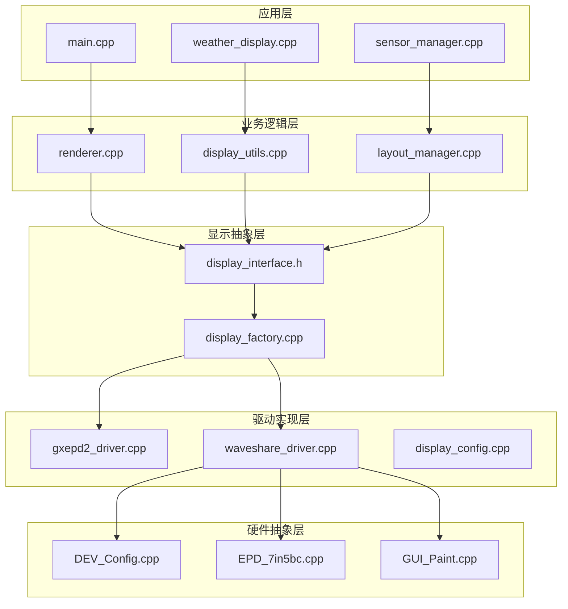
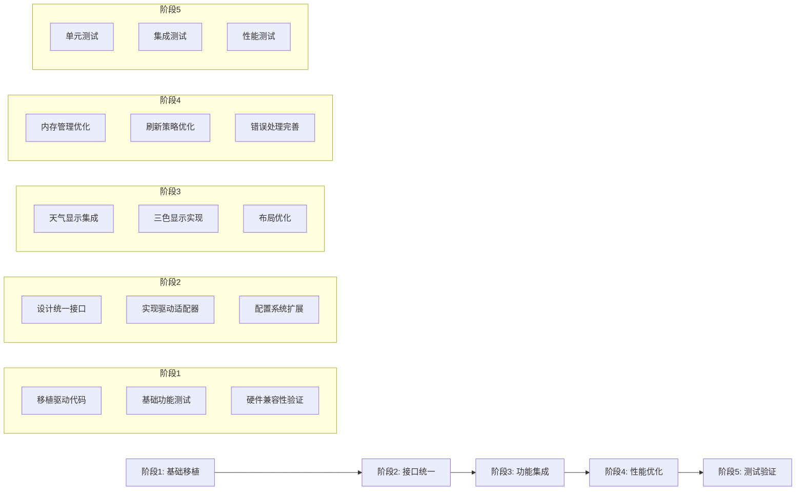

# Waveshare EPD 7in5bc 显示屏移植设计文档

## 设计概述

本设计文档描述了将微雪7.5英寸三色电子墨水屏(EPD 7in5bc)驱动技术从Demo项目移植到主项目的完整技术方案。设计采用分层架构、接口抽象和渐进式集成策略，确保系统的稳定性、可扩展性和向后兼容性。

## 架构设计

### 整体架构



### 核心组件设计

#### 1. 显示接口抽象层

```cpp
// display_interface.h
class DisplayInterface {
public:
    virtual ~DisplayInterface() = default;
    
    // 基础生命周期管理
    virtual bool init() = 0;
    virtual void clear() = 0;
    virtual void display() = 0;
    virtual void sleep() = 0;
    virtual void wakeup() = 0;
    
    // 绘制功能接口
    virtual void drawBitmap(int16_t x, int16_t y, const uint8_t* bitmap, 
                           int16_t w, int16_t h, uint16_t color = 0) = 0;
    virtual void drawString(int16_t x, int16_t y, const String& text, 
                           uint16_t color = 0) = 0;
    virtual void drawLine(int16_t x0, int16_t y0, int16_t x1, int16_t y1, 
                         uint16_t color = 0) = 0;
    virtual void drawRect(int16_t x, int16_t y, int16_t w, int16_t h, 
                         uint16_t color = 0) = 0;
    virtual void fillRect(int16_t x, int16_t y, int16_t w, int16_t h, 
                         uint16_t color = 0) = 0;
    
    // 属性查询接口
    virtual int16_t width() const = 0;
    virtual int16_t height() const = 0;
    virtual bool supportsColor() const = 0;
    virtual uint8_t getColorDepth() const = 0;
    
    // 状态查询接口
    virtual bool isReady() const = 0;
    virtual String getDriverName() const = 0;
    virtual String getLastError() const = 0;
    
    // 高级功能接口
    virtual void setRotation(uint8_t rotation) = 0;
    virtual void setFont(const void* font) = 0;
    virtual void setTextColor(uint16_t color) = 0;
    virtual void setTextSize(uint8_t size) = 0;
};
```

#### 2. Waveshare驱动实现

```cpp
// waveshare_driver.h
class WaveshareDriver : public DisplayInterface {
private:
    // 缓冲区管理
    UBYTE* blackBuffer;
    UBYTE* redBuffer;
    size_t bufferSize;
    bool buffersAllocated;
    
    // 状态管理
    bool initialized;
    bool displayReady;
    String lastError;
    
    // 配置参数
    uint8_t currentRotation;
    const void* currentFont;
    uint16_t textColor;
    uint8_t textSize;
    
    // 性能监控
    unsigned long lastRefreshTime;
    unsigned long totalRefreshes;
    unsigned long failedRefreshes;
    
public:
    WaveshareDriver();
    virtual ~WaveshareDriver();
    
    // DisplayInterface实现
    bool init() override;
    void clear() override;
    void display() override;
    void sleep() override;
    void wakeup() override;
    
    void drawBitmap(int16_t x, int16_t y, const uint8_t* bitmap, 
                   int16_t w, int16_t h, uint16_t color = 0) override;
    void drawString(int16_t x, int16_t y, const String& text, 
                   uint16_t color = 0) override;
    void drawLine(int16_t x0, int16_t y0, int16_t x1, int16_t y1, 
                 uint16_t color = 0) override;
    void drawRect(int16_t x, int16_t y, int16_t w, int16_t h, 
                 uint16_t color = 0) override;
    void fillRect(int16_t x, int16_t y, int16_t w, int16_t h, 
                 uint16_t color = 0) override;
    
    int16_t width() const override { return EPD_7IN5BC_WIDTH; }
    int16_t height() const override { return EPD_7IN5BC_HEIGHT; }
    bool supportsColor() const override { return true; }
    uint8_t getColorDepth() const override { return 3; } // 黑、白、红
    
    bool isReady() const override { return displayReady; }
    String getDriverName() const override { return "Waveshare EPD 7in5bc"; }
    String getLastError() const override { return lastError; }
    
    void setRotation(uint8_t rotation) override;
    void setFont(const void* font) override;
    void setTextColor(uint16_t color) override;
    void setTextSize(uint8_t size) override;
    
    // Waveshare特有功能
    void selectBuffer(bool useRedBuffer);
    void drawWeatherIcon(int16_t x, int16_t y, int weatherId, bool useRed = false);
    void drawBatteryIndicator(int16_t x, int16_t y, uint8_t percentage, bool warning = false);
    void drawSignalStrength(int16_t x, int16_t y, int8_t rssi);
    
    // 性能和诊断
    void getPerformanceStats(unsigned long& refreshes, unsigned long& failures, 
                           unsigned long& avgTime);
    bool performSelfTest();
    void resetErrorState();
    
private:
    bool allocateBuffers();
    void releaseBuffers();
    bool initializeHardware();
    void handleError(const String& error);
    void updatePerformanceStats(bool success, unsigned long duration);
};
```

#### 3. 显示工厂类

```cpp
// display_factory.h
enum class DisplayDriverType {
    GXEPD2_BW_V1,
    GXEPD2_BW_V2,
    GXEPD2_3C_B,
    GXEPD2_7C_F,
    WAVESHARE_7IN5BC,
    AUTO_DETECT
};

class DisplayFactory {
public:
    static std::unique_ptr<DisplayInterface> createDisplay(DisplayDriverType type);
    static std::unique_ptr<DisplayInterface> createDisplay(const String& driverName);
    static DisplayDriverType detectDisplayType();
    static std::vector<String> getAvailableDrivers();
    static bool isDriverSupported(DisplayDriverType type);
    
private:
    static bool testWaveshareConnection();
    static bool testGxEPD2Connection();
};

// display_factory.cpp
std::unique_ptr<DisplayInterface> DisplayFactory::createDisplay(DisplayDriverType type) {
    switch (type) {
        case DisplayDriverType::WAVESHARE_7IN5BC:
            return std::make_unique<WaveshareDriver>();
            
        case DisplayDriverType::GXEPD2_BW_V2:
            return std::make_unique<GxEPD2Driver>(GxEPD2Driver::Type::BW_V2);
            
        case DisplayDriverType::GXEPD2_3C_B:
            return std::make_unique<GxEPD2Driver>(GxEPD2Driver::Type::THREE_COLOR_B);
            
        case DisplayDriverType::AUTO_DETECT:
            return createDisplay(detectDisplayType());
            
        default:
            return nullptr;
    }
}

DisplayDriverType DisplayFactory::detectDisplayType() {
    // 首先尝试检测Waveshare连接
    if (testWaveshareConnection()) {
        return DisplayDriverType::WAVESHARE_7IN5BC;
    }
    
    // 回退到GxEPD2检测
    if (testGxEPD2Connection()) {
        // 根据配置返回相应的GxEPD2类型
        #ifdef DISP_BW_V2
            return DisplayDriverType::GXEPD2_BW_V2;
        #elif defined(DISP_3C_B)
            return DisplayDriverType::GXEPD2_3C_B;
        #elif defined(DISP_7C_F)
            return DisplayDriverType::GXEPD2_7C_F;
        #else
            return DisplayDriverType::GXEPD2_BW_V1;
        #endif
    }
    
    // 默认返回配置的类型
    return DisplayDriverType::GXEPD2_BW_V2;
}
```

### 数据模型设计

#### 1. 显示配置模型

```cpp
// display_config.h
struct DisplayConfig {
    DisplayDriverType driverType = DisplayDriverType::AUTO_DETECT;
    
    // GPIO配置
    struct GPIOConfig {
        uint8_t cs = 15;
        uint8_t dc = 27;
        uint8_t rst = 26;
        uint8_t busy = 25;
        uint8_t sck = 13;
        uint8_t mosi = 14;
        uint8_t miso = 12;
    } gpio;
    
    // 显示参数
    struct DisplayParams {
        uint8_t rotation = 0;
        bool invertColors = false;
        uint16_t refreshInterval = 30000; // ms
        bool enablePartialRefresh = true;
        uint8_t contrastLevel = 128;
    } params;
    
    // 性能参数
    struct PerformanceParams {
        uint32_t spiSpeed = 4000000; // 4MHz
        uint16_t refreshTimeout = 10000; // ms
        uint8_t maxRetries = 3;
        bool enablePSRAM = true;
        uint16_t bufferAlignment = 4;
    } performance;
    
    // 错误处理参数
    struct ErrorHandling {
        bool autoRecovery = true;
        uint16_t recoveryDelay = 1000; // ms
        uint8_t maxConsecutiveFailures = 5;
        bool enableWatchdog = true;
    } errorHandling;
};

class DisplayConfigManager {
public:
    static DisplayConfig loadConfig();
    static bool saveConfig(const DisplayConfig& config);
    static DisplayConfig getDefaultConfig();
    static bool validateConfig(const DisplayConfig& config);
    
private:
    static const char* CONFIG_FILE_PATH;
    static DisplayConfig defaultConfig;
};
```

#### 2. 颜色管理模型

```cpp
// color_manager.h
enum class DisplayColor : uint16_t {
    BLACK = 0x0000,
    WHITE = 0xFFFF,
    RED   = 0xF800,
    
    // 语义化颜色
    PRIMARY_TEXT = BLACK,
    SECONDARY_TEXT = BLACK,
    BACKGROUND = WHITE,
    ACCENT = RED,
    WARNING = RED,
    ERROR = RED,
    SUCCESS = BLACK,
    INFO = BLACK
};

class ColorScheme {
public:
    DisplayColor background = DisplayColor::WHITE;
    DisplayColor primaryText = DisplayColor::BLACK;
    DisplayColor secondaryText = DisplayColor::BLACK;
    DisplayColor accent = DisplayColor::RED;
    DisplayColor warning = DisplayColor::RED;
    DisplayColor error = DisplayColor::RED;
    DisplayColor success = DisplayColor::BLACK;
    DisplayColor info = DisplayColor::BLACK;
    
    // 主题支持
    enum class Theme {
        DEFAULT,
        HIGH_CONTRAST,
        MINIMAL,
        COLORFUL
    };
    
    static ColorScheme getTheme(Theme theme);
    void applyTheme(Theme theme);
};

class ColorManager {
public:
    static uint16_t convertColor(DisplayColor color, DisplayDriverType driverType);
    static DisplayColor getSemanticColor(const String& semantic);
    static bool isColorSupported(DisplayColor color, DisplayDriverType driverType);
    static std::vector<DisplayColor> getSupportedColors(DisplayDriverType driverType);
    
private:
    static std::map<DisplayDriverType, std::map<DisplayColor, uint16_t>> colorMappings;
};
```

### 组件接口设计

#### 1. 布局管理器

```cpp
// layout_manager.h
struct LayoutRegion {
    int16_t x, y, width, height;
    DisplayColor backgroundColor;
    bool visible;
    uint8_t zIndex;
    
    bool contains(int16_t px, int16_t py) const;
    bool intersects(const LayoutRegion& other) const;
};

class LayoutManager {
public:
    // 预定义布局区域
    enum class Region {
        WEATHER_ICON,      // 天气图标区域
        MAIN_INFO,         // 主要信息区域
        SENSOR_DATA,       // 传感器数据区域
        FORECAST,          // 预报信息区域
        STATUS_BAR,        // 状态栏区域
        ALERT_AREA         // 警告信息区域
    };
    
    LayoutManager(int16_t screenWidth, int16_t screenHeight);
    
    // 区域管理
    void defineRegion(Region region, const LayoutRegion& layout);
    LayoutRegion getRegion(Region region) const;
    bool isRegionVisible(Region region) const;
    void setRegionVisibility(Region region, bool visible);
    
    // 布局计算
    void calculateLayout();
    void optimizeLayout();
    bool validateLayout() const;
    
    // 响应式布局
    void setScreenSize(int16_t width, int16_t height);
    void setOrientation(uint8_t rotation);
    void adaptToContent(const std::map<Region, String>& content);
    
    // 绘制辅助
    void drawRegionBorders(DisplayInterface* display, DisplayColor color = DisplayColor::BLACK);
    void clearRegion(DisplayInterface* display, Region region);
    void highlightRegion(DisplayInterface* display, Region region, DisplayColor color);
    
private:
    int16_t screenWidth, screenHeight;
    uint8_t orientation;
    std::map<Region, LayoutRegion> regions;
    
    void calculateDefaultLayout();
    void adjustForOrientation();
    bool checkOverlaps() const;
};
```

#### 2. 渲染管理器

```cpp
// render_manager.h
class RenderManager {
public:
    RenderManager(std::unique_ptr<DisplayInterface> display);
    
    // 渲染控制
    void beginRender();
    void endRender();
    void cancelRender();
    bool isRendering() const;
    
    // 内容渲染
    void renderWeatherDisplay(const WeatherData& data);
    void renderSensorData(const SensorData& data);
    void renderStatusBar(const SystemStatus& status);
    void renderAlerts(const std::vector<Alert>& alerts);
    
    // 渲染优化
    void enablePartialRefresh(bool enable);
    void setRefreshStrategy(RefreshStrategy strategy);
    void optimizeForBattery(bool enable);
    
    // 错误处理
    void setErrorHandler(std::function<void(const String&)> handler);
    void retryLastRender();
    void resetRenderState();
    
private:
    std::unique_ptr<DisplayInterface> display;
    LayoutManager layoutManager;
    ColorScheme colorScheme;
    
    bool rendering;
    bool partialRefreshEnabled;
    RefreshStrategy refreshStrategy;
    std::function<void(const String&)> errorHandler;
    
    // 渲染缓存
    struct RenderCache {
        bool weatherIconCached;
        bool sensorDataCached;
        bool statusBarCached;
        unsigned long lastFullRefresh;
    } cache;
    
    void renderWeatherIcon(const WeatherData& data);
    void renderTemperature(const WeatherData& data);
    void renderForecast(const WeatherData& data);
    void updateRenderCache();
    bool shouldFullRefresh() const;
};

enum class RefreshStrategy {
    ALWAYS_FULL,      // 总是全屏刷新
    SMART_PARTIAL,    // 智能局部刷新
    MINIMAL_UPDATE,   // 最小更新
    BATTERY_OPTIMIZED // 电池优化模式
};
```

### 错误处理设计

#### 1. 错误分类和处理

```cpp
// error_handler.h
enum class DisplayErrorType {
    INITIALIZATION_FAILED,
    SPI_COMMUNICATION_ERROR,
    MEMORY_ALLOCATION_FAILED,
    DISPLAY_NOT_RESPONDING,
    BUFFER_OVERFLOW,
    INVALID_PARAMETER,
    TIMEOUT_ERROR,
    HARDWARE_FAULT,
    CONFIGURATION_ERROR,
    UNKNOWN_ERROR
};

struct DisplayError {
    DisplayErrorType type;
    String message;
    String details;
    unsigned long timestamp;
    uint8_t severity; // 1-5, 5 being critical
    bool recoverable;
    
    String toString() const;
};

class DisplayErrorHandler {
public:
    using ErrorCallback = std::function<void(const DisplayError&)>;
    
    static void setErrorCallback(ErrorCallback callback);
    static void reportError(DisplayErrorType type, const String& message, 
                          const String& details = "", uint8_t severity = 3);
    
    static bool attemptRecovery(DisplayErrorType type);
    static void clearErrorHistory();
    static std::vector<DisplayError> getErrorHistory();
    static DisplayError getLastError();
    
    // 错误统计
    static uint32_t getErrorCount(DisplayErrorType type);
    static float getErrorRate(); // errors per hour
    static bool isSystemHealthy();
    
private:
    static std::vector<DisplayError> errorHistory;
    static ErrorCallback errorCallback;
    static const size_t MAX_ERROR_HISTORY = 100;
    
    static bool recoverFromInitializationFailure();
    static bool recoverFromSPIError();
    static bool recoverFromMemoryError();
    static bool recoverFromDisplayTimeout();
};
```

#### 2. 健康监控系统

```cpp
// health_monitor.h
struct HealthMetrics {
    // 性能指标
    unsigned long totalRefreshes;
    unsigned long successfulRefreshes;
    unsigned long failedRefreshes;
    unsigned long averageRefreshTime;
    unsigned long maxRefreshTime;
    
    // 资源使用
    size_t memoryUsage;
    size_t maxMemoryUsage;
    float cpuUsage;
    
    // 错误统计
    uint32_t totalErrors;
    uint32_t criticalErrors;
    unsigned long lastErrorTime;
    
    // 系统状态
    unsigned long uptime;
    unsigned long lastSuccessfulRefresh;
    bool systemHealthy;
    
    float getSuccessRate() const;
    float getErrorRate() const;
    String getHealthSummary() const;
};

class HealthMonitor {
public:
    static void initialize();
    static void recordRefresh(bool success, unsigned long duration);
    static void recordMemoryUsage(size_t usage);
    static void recordError(DisplayErrorType type);
    
    static HealthMetrics getCurrentMetrics();
    static bool isSystemHealthy();
    static String generateHealthReport();
    
    // 阈值管理
    static void setHealthThresholds(float minSuccessRate, uint32_t maxErrorsPerHour);
    static void enableAutoRecovery(bool enable);
    
    // 监控控制
    static void startMonitoring();
    static void stopMonitoring();
    static void resetMetrics();
    
private:
    static HealthMetrics metrics;
    static bool monitoring;
    static float minSuccessRateThreshold;
    static uint32_t maxErrorsPerHourThreshold;
    static bool autoRecoveryEnabled;
    
    static void updateHealthStatus();
    static void triggerAutoRecovery();
    static void logHealthEvent(const String& event);
};
```

### 测试策略设计

#### 1. 单元测试框架

```cpp
// test_framework.h
class DisplayTestFramework {
public:
    // 测试套件管理
    static void runAllTests();
    static void runDriverTests();
    static void runInterfaceTests();
    static void runPerformanceTests();
    
    // 具体测试用例
    static bool testDriverInitialization();
    static bool testBufferAllocation();
    static bool testBasicDrawing();
    static bool testColorMapping();
    static bool testErrorHandling();
    static bool testMemoryManagement();
    
    // 性能测试
    static bool testRefreshPerformance();
    static bool testMemoryUsage();
    static bool testConcurrentAccess();
    
    // 压力测试
    static bool testLongRunning();
    static bool testErrorRecovery();
    static bool testResourceExhaustion();
    
    // 测试报告
    static String generateTestReport();
    static void exportTestResults(const String& filename);
    
private:
    struct TestResult {
        String testName;
        bool passed;
        String errorMessage;
        unsigned long duration;
    };
    
    static std::vector<TestResult> testResults;
    static void recordTestResult(const String& testName, bool passed, 
                                const String& error = "", unsigned long duration = 0);
};
```

## 实现策略

### 1. 渐进式集成策略



### 2. 风险缓解策略

#### 高风险项缓解措施
1. **硬件兼容性问题**
   - 提前进行硬件测试验证
   - 准备多种硬件配置方案
   - 实现自动检测和适配机制

2. **性能回归风险**
   - 建立性能基准测试
   - 实施持续性能监控
   - 提供性能调优选项

3. **复杂错误处理**
   - 采用分层错误处理策略
   - 实现自动恢复机制
   - 提供详细的错误诊断信息

#### 中等风险项缓解措施
1. **内存管理复杂性**
   - 使用智能指针和RAII模式
   - 实现内存池管理
   - 提供内存使用监控

2. **多驱动切换逻辑**
   - 设计清晰的接口抽象
   - 实现工厂模式
   - 提供驱动兼容性检查

### 3. 质量保证策略

#### 代码质量保证
- 代码审查流程
- 静态代码分析
- 编码规范检查
- 文档完整性验证

#### 测试质量保证
- 单元测试覆盖率 ≥ 80%
- 集成测试完整性
- 性能测试基准
- 压力测试验证

#### 部署质量保证
- 分阶段部署策略
- 回滚机制准备
- 监控和告警系统
- 用户反馈收集

## 性能优化设计

### 1. 内存优化策略

```cpp
// memory_manager.h
class DisplayMemoryManager {
public:
    // 内存池管理
    static bool initializeMemoryPool(size_t poolSize);
    static void* allocateFromPool(size_t size);
    static void deallocateToPool(void* ptr);
    static void cleanupMemoryPool();
    
    // 缓冲区管理
    static bool allocateDisplayBuffers(size_t bufferSize);
    static void releaseDisplayBuffers();
    static bool reallocateBuffers(size_t newSize);
    
    // 内存监控
    static size_t getTotalMemoryUsage();
    static size_t getAvailableMemory();
    static float getMemoryFragmentation();
    static void defragmentMemory();
    
    // PSRAM支持
    static bool isPSRAMAvailable();
    static void* allocateFromPSRAM(size_t size);
    static void enablePSRAMUsage(bool enable);
    
private:
    static void* memoryPool;
    static size_t poolSize;
    static size_t poolUsed;
    static bool psramEnabled;
    
    static void* displayBuffers[2]; // black and red buffers
    static size_t bufferSize;
    static bool buffersAllocated;
};
```

### 2. 刷新优化策略

```cpp
// refresh_optimizer.h
class RefreshOptimizer {
public:
    enum class RefreshMode {
        FULL_REFRESH,
        PARTIAL_REFRESH,
        DIFFERENTIAL_REFRESH,
        SMART_REFRESH
    };
    
    static void setRefreshMode(RefreshMode mode);
    static RefreshMode getOptimalRefreshMode(const DisplayContent& content);
    
    // 刷新决策
    static bool shouldRefresh(const DisplayContent& newContent, 
                             const DisplayContent& currentContent);
    static std::vector<LayoutRegion> getChangedRegions(const DisplayContent& newContent,
                                                       const DisplayContent& currentContent);
    
    // 刷新调度
    static void scheduleRefresh(unsigned long delay = 0);
    static void cancelScheduledRefresh();
    static bool isRefreshScheduled();
    
    // 性能监控
    static void recordRefreshTime(RefreshMode mode, unsigned long duration);
    static unsigned long getAverageRefreshTime(RefreshMode mode);
    static RefreshMode getFastestRefreshMode();
    
private:
    static RefreshMode currentMode;
    static std::map<RefreshMode, std::vector<unsigned long>> refreshTimes;
    static unsigned long lastRefreshTime;
    static bool refreshScheduled;
};
```

## 安全性设计

### 1. 输入验证

```cpp
// input_validator.h
class InputValidator {
public:
    // 参数验证
    static bool validateCoordinates(int16_t x, int16_t y, int16_t maxWidth, int16_t maxHeight);
    static bool validateDimensions(int16_t width, int16_t height);
    static bool validateColor(uint16_t color, DisplayDriverType driverType);
    static bool validateBufferSize(size_t size, size_t maxSize);
    
    // 配置验证
    static bool validateDisplayConfig(const DisplayConfig& config);
    static bool validateGPIOConfig(const DisplayConfig::GPIOConfig& gpio);
    static bool validatePerformanceParams(const DisplayConfig::PerformanceParams& params);
    
    // 内容验证
    static bool validateTextContent(const String& text, size_t maxLength = 1000);
    static bool validateBitmapData(const uint8_t* bitmap, size_t size);
    static bool validateFontData(const void* font);
    
    // 安全检查
    static bool checkMemoryBounds(const void* ptr, size_t size);
    static bool checkBufferOverflow(size_t requestedSize, size_t availableSize);
    static bool checkResourceLimits();
    
private:
    static const size_t MAX_TEXT_LENGTH = 1000;
    static const size_t MAX_BITMAP_SIZE = 100000;
    static const int16_t MAX_COORDINATE = 32767;
};
```

### 2. 资源保护

```cpp
// resource_guard.h
class ResourceGuard {
public:
    // RAII资源管理
    class BufferGuard {
    public:
        BufferGuard(size_t size);
        ~BufferGuard();
        void* get() const { return buffer; }
        bool isValid() const { return buffer != nullptr; }
        
    private:
        void* buffer;
        size_t size;
    };
    
    class DisplayLock {
    public:
        DisplayLock();
        ~DisplayLock();
        bool isLocked() const { return locked; }
        
    private:
        bool locked;
        static bool displayInUse;
    };
    
    // 资源限制
    static void setMaxMemoryUsage(size_t maxBytes);
    static void setMaxRefreshRate(float maxHz);
    static void setMaxConcurrentOperations(uint8_t maxOps);
    
    // 资源监控
    static bool checkResourceAvailability();
    static void enforceResourceLimits();
    static String getResourceStatus();
    
private:
    static size_t maxMemoryUsage;
    static float maxRefreshRate;
    static uint8_t maxConcurrentOps;
    static uint8_t currentOperations;
};
```

## 总结

本设计文档提供了将Waveshare EPD 7in5bc显示屏技术移植到主项目的完整技术方案。设计采用了分层架构、接口抽象、渐进式集成等策略，确保了系统的稳定性、可扩展性和向后兼容性。

关键设计特点：
1. **模块化架构**: 清晰的分层设计便于维护和扩展
2. **接口抽象**: 统一的显示接口支持多种驱动
3. **错误处理**: 完善的错误处理和恢复机制
4. **性能优化**: 内存管理和刷新策略优化
5. **质量保证**: 全面的测试和监控体系

通过这个设计方案，可以有效地将Demo项目的成功经验移植到主项目中，实现显示质量和系统稳定性的双重提升。