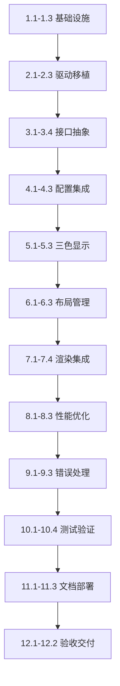
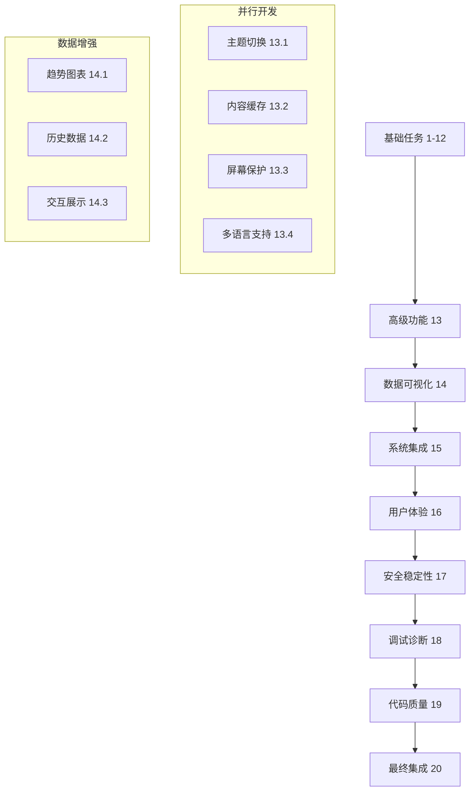

# Waveshare EPD 7in5bc 显示屏移植实施任务

## 实施计划概述

本任务列表将Waveshare EPD 7in5bc显示屏移植项目分解为具体的可执行任务，采用增量开发和测试驱动的方式，确保每个步骤都能产生可验证的成果。

## 任务列表

### 1. 项目基础设施搭建

- [ ] 1.1 创建显示驱动模块目录结构
  - 在 `src/display/` 下创建 `waveshare/` 目录
  - 创建 `gxepd2/` 目录用于现有驱动
  - 设置头文件包含路径和编译配置
  - _需求: 1.1, 2.1_

- [ ] 1.2 配置构建系统支持多驱动
  - 修改 `platformio.ini` 添加条件编译选项
  - 创建驱动选择的预处理器宏定义
  - 配置库依赖和包含路径
  - _需求: 2.2, 7.1_

- [ ] 1.3 建立基础测试框架
  - 创建 `test/display/` 测试目录
  - 实现基础的测试工具类和断言宏
  - 配置测试运行环境和报告生成
  - _需求: 8.1, 8.2_

### 2. 核心驱动代码移植

- [ ] 2.1 移植硬件抽象层代码
  - 从Demo项目复制 `DEV_Config.cpp` 和 `DEV_Config.h`
  - 适配ESP32 Arduino框架的GPIO和SPI接口
  - 实现延时和调试输出函数
  - 编写单元测试验证硬件抽象层功能
  - _需求: 1.1, 1.4_

- [ ] 2.2 移植EPD驱动核心代码
  - 复制 `EPD_7in5bc.cpp` 和 `EPD_7in5bc.h` 文件
  - 修复编译错误和依赖问题
  - 实现初始化、显示、清屏和睡眠功能
  - 编写驱动功能测试用例
  - _需求: 1.1, 1.3_

- [ ] 2.3 移植图形绘制库代码
  - 复制 `GUI_Paint.cpp` 和 `GUI_Paint.h` 文件
  - 移植字体文件和图像数据结构
  - 实现基础图形绘制功能(点、线、矩形、圆形)
  - 实现文本渲染功能(英文和中文)
  - 编写图形绘制测试用例
  - _需求: 3.1, 3.2_

### 3. 显示接口抽象层实现

- [ ] 3.1 设计统一显示接口
  - 创建 `DisplayInterface` 抽象基类
  - 定义标准的显示操作接口方法
  - 设计颜色管理和坐标系统
  - 编写接口设计文档和使用示例
  - _需求: 2.1, 2.2_

- [ ] 3.2 实现Waveshare驱动适配器
  - 创建 `WaveshareDriver` 类实现 `DisplayInterface`
  - 实现缓冲区管理和内存分配逻辑
  - 实现基础绘制功能的接口适配
  - 添加Waveshare特有功能接口
  - 编写适配器功能测试
  - _需求: 1.1, 2.1, 5.1_

- [ ] 3.3 实现GxEPD2驱动适配器
  - 创建 `GxEPD2Driver` 类实现 `DisplayInterface`
  - 封装现有GxEPD2库的功能调用
  - 确保与Waveshare驱动接口一致性
  - 实现驱动切换和兼容性测试
  - _需求: 2.2, 9.1, 9.2_

- [ ] 3.4 实现显示驱动工厂类
  - 创建 `DisplayFactory` 类管理驱动创建
  - 实现自动检测和驱动选择逻辑
  - 添加驱动可用性检查功能
  - 实现驱动切换和错误处理
  - 编写工厂类测试用例
  - _需求: 2.1, 2.4_

### 4. 配置系统集成

- [ ] 4.1 扩展配置数据结构
  - 在 `config.h` 中添加显示驱动配置选项
  - 定义GPIO引脚配置和显示参数
  - 添加性能调优和错误处理配置
  - 实现配置验证和默认值设置
  - _需求: 7.1, 7.2_

- [ ] 4.2 实现配置管理器
  - 创建 `DisplayConfigManager` 类
  - 实现配置文件读取和保存功能
  - 添加配置验证和错误处理
  - 实现运行时配置更新机制
  - 编写配置管理测试用例
  - _需求: 7.3, 7.4_

- [ ] 4.3 集成到主配置系统
  - 修改 `config.cpp` 集成显示配置
  - 更新配置初始化和验证流程
  - 确保向后兼容性和平滑升级
  - 编写配置集成测试
  - _需求: 7.1, 9.3_

### 5. 三色显示功能实现

- [ ] 5.1 实现颜色管理系统
  - 创建 `ColorManager` 类管理颜色映射
  - 定义语义化颜色和主题系统
  - 实现不同驱动的颜色转换
  - 添加颜色支持检查功能
  - 编写颜色管理测试用例
  - _需求: 3.1, 3.3_

- [ ] 5.2 实现双缓冲区管理
  - 扩展缓冲区管理支持黑色和红色缓冲区
  - 实现缓冲区切换和合并显示逻辑
  - 优化内存分配和释放策略
  - 添加缓冲区状态监控功能
  - 编写缓冲区管理测试
  - _需求: 3.2, 5.1, 5.2_

- [ ] 5.3 实现三色绘制功能
  - 扩展绘制接口支持颜色参数
  - 实现三色图形绘制算法
  - 添加颜色混合和叠加效果
  - 实现三色文本渲染功能
  - 编写三色绘制测试用例
  - _需求: 3.1, 3.2, 3.3_

### 6. 布局管理系统实现

- [ ] 6.1 设计响应式布局系统
  - 创建 `LayoutManager` 类管理屏幕布局
  - 定义标准布局区域和响应式规则
  - 实现布局计算和优化算法
  - 添加布局验证和调试功能
  - 编写布局系统测试用例
  - _需求: 4.1, 4.2_

- [ ] 6.2 实现天气显示布局
  - 设计640×384分辨率的最优布局
  - 实现天气图标、温度、预报等区域布局
  - 优化信息密度和可读性
  - 添加布局自适应功能
  - 编写天气布局测试
  - _需求: 4.1, 4.3, 4.4_

- [ ] 6.3 实现状态栏和警告区域
  - 设计状态栏布局和信息显示
  - 实现电池、WiFi、时间等状态指示
  - 添加警告信息显示区域
  - 实现动态布局调整功能
  - 编写状态显示测试
  - _需求: 4.5, 3.4_

### 7. 渲染系统集成

- [ ] 7.1 重构现有渲染代码
  - 修改 `renderer.cpp` 使用统一显示接口
  - 重构天气信息渲染函数
  - 适配新的布局管理系统
  - 保持现有功能的完整性
  - 编写渲染重构测试
  - _需求: 2.1, 4.1_

- [ ] 7.2 实现三色天气显示
  - 修改天气图标渲染支持三色显示
  - 实现温度和文本的颜色分配策略
  - 添加警告信息的红色突出显示
  - 优化视觉层次和信息表达
  - 编写三色显示测试
  - _需求: 3.1, 3.2, 3.4_

- [ ] 7.3 实现传感器数据显示
  - 集成室内温湿度、气压等传感器数据显示
  - 实现数据可视化和趋势显示
  - 添加数据异常的颜色警告
  - 优化数据布局和可读性
  - 编写传感器显示测试
  - _需求: 4.3, 3.4_

- [ ] 7.4 实现状态指示器渲染
  - 实现电池状态的图形化显示
  - 添加WiFi信号强度指示器
  - 实现系统状态和错误指示
  - 添加更新时间和版本信息显示
  - 编写状态指示器测试
  - _需求: 4.5, 3.4_

### 8. 性能优化实现

- [ ] 8.1 实现智能内存管理
  - 创建 `DisplayMemoryManager` 类
  - 实现内存池和PSRAM支持
  - 添加内存使用监控和优化
  - 实现内存碎片整理功能
  - 编写内存管理测试用例
  - _需求: 5.1, 5.2_

- [ ] 8.2 实现刷新策略优化
  - 创建 `RefreshOptimizer` 类
  - 实现智能刷新决策算法
  - 添加局部刷新和差分更新
  - 优化刷新时序和电源管理
  - 编写刷新优化测试
  - _需求: 5.4, 5.5_

- [ ] 8.3 实现性能监控系统
  - 创建 `PerformanceMonitor` 类
  - 添加刷新时间和内存使用统计
  - 实现性能基准测试和报告
  - 添加性能告警和自动优化
  - 编写性能监控测试
  - _需求: 5.3, 8.3_

### 9. 错误处理和恢复系统

- [ ] 9.1 实现错误分类和报告
  - 创建 `DisplayErrorHandler` 类
  - 定义错误类型和严重级别
  - 实现错误记录和报告机制
  - 添加错误统计和分析功能
  - 编写错误处理测试用例
  - _需求: 6.1, 6.2_

- [ ] 9.2 实现自动恢复机制
  - 实现SPI通信错误恢复
  - 添加显示屏无响应恢复
  - 实现内存分配失败恢复
  - 添加系统级恢复和重启机制
  - 编写恢复机制测试
  - _需求: 6.1, 6.3, 6.4_

- [ ] 9.3 实现健康监控系统
  - 创建 `HealthMonitor` 类
  - 实现系统健康指标收集
  - 添加健康状态评估和报告
  - 实现预防性维护和告警
  - 编写健康监控测试
  - _需求: 6.5, 6.6_

### 10. 测试和验证

- [ ] 10.1 完善单元测试套件
  - 为所有核心类编写单元测试
  - 实现测试数据生成和模拟
  - 添加边界条件和异常测试
  - 确保测试覆盖率达到80%以上
  - 生成测试报告和覆盖率分析
  - _需求: 8.1, 8.2_

- [ ] 10.2 实现集成测试
  - 编写端到端天气显示测试
  - 实现驱动切换和兼容性测试
  - 添加配置管理和错误恢复测试
  - 实现多场景和用例测试
  - 编写集成测试报告
  - _需求: 8.2, 8.3_

- [ ] 10.3 执行性能和压力测试
  - 实现显示刷新性能基准测试
  - 执行长时间运行稳定性测试
  - 进行内存泄漏和资源使用测试
  - 实现并发访问和压力测试
  - 生成性能测试报告
  - _需求: 8.3, 8.4_

- [ ] 10.4 执行兼容性和回归测试
  - 验证与现有GxEPD2驱动的兼容性
  - 执行配置向后兼容性测试
  - 进行功能回归测试
  - 验证不同硬件配置的兼容性
  - 编写兼容性测试报告
  - _需求: 9.1, 9.2, 9.3_

### 11. 文档和部署

- [ ] 11.1 编写技术文档
  - 更新架构设计文档
  - 编写API参考文档
  - 创建配置和部署指南
  - 编写故障排除和维护手册
  - _需求: 10.1, 10.2_

- [ ] 11.2 编写用户文档
  - 更新用户安装和配置指南
  - 编写功能使用说明
  - 创建FAQ和常见问题解答
  - 编写升级和迁移指南
  - _需求: 10.3, 10.4_

- [ ] 11.3 准备发布和部署
  - 创建发布版本和变更日志
  - 准备示例配置和演示代码
  - 实现自动化构建和测试流程
  - 准备社区发布和反馈收集
  - _需求: 10.5_

### 12. 验收和交付

- [ ] 12.1 执行用户验收测试
  - 邀请用户参与功能验收测试
  - 收集用户反馈和改进建议
  - 修复发现的问题和缺陷
  - 验证用户满意度指标
  - _需求: 所有需求的最终验证_

- [ ] 12.2 完成项目交付
  - 完成所有代码审查和质量检查
  - 提交最终版本到代码仓库
  - 更新项目文档和README
  - 发布正式版本和公告
  - _需求: 项目成功标准验证_

## 任务依赖关系

## 里程碑和时间规划

### 里程碑1: 基础移植完成 (第1-2周)
- 完成任务 1.1-1.3, 2.1-2.3
- 交付物: 可编译的基础驱动代码和测试用例
- 验收标准: 基础显示功能正常工作

### 里程碑2: 接口统一完成 (第3-4周)
- 完成任务 3.1-3.4, 4.1-4.3
- 交付物: 统一显示接口和配置系统
- 验收标准: 支持多驱动切换和配置管理

### 里程碑3: 功能集成完成 (第5-6周)
- 完成任务 5.1-5.3, 6.1-6.3, 7.1-7.4
- 交付物: 完整的三色天气显示功能
- 验收标准: 天气信息正确显示，布局合理

### 里程碑4: 优化完善完成 (第7-8周)
- 完成任务 8.1-8.3, 9.1-9.3, 10.1-10.4
- 交付物: 性能优化和错误处理系统
- 验收标准: 性能指标达标，系统稳定可靠

### 里程碑5: 项目交付完成 (第9周)
- 完成任务 11.1-11.3, 12.1-12.2
- 交付物: 完整的项目交付包
- 验收标准: 所有需求满足，用户验收通过

## 质量保证措施

### 代码质量
- 每个任务完成后进行代码审查
- 使用静态代码分析工具检查
- 遵循项目编码规范和最佳实践
- 确保代码注释和文档完整

### 测试质量
- 每个功能模块都有对应的单元测试
- 集成测试覆盖主要用例场景
- 性能测试验证关键指标
- 回归测试确保无功能损失

### 交付质量
- 分阶段交付和验收
- 持续集成和自动化测试
- 用户反馈收集和问题修复
- 完整的文档和支持材料

## 风险管控

### 技术风险
- 定期技术评审和风险评估
- 准备备选技术方案
- 及时解决技术难题和阻塞

### 进度风险
- 每周进度跟踪和调整
- 关键路径监控和优化
- 资源调配和支持保障

### 质量风险
- 严格的测试和验收流程
- 持续的质量监控和改进
- 用户反馈快速响应机制

通过这个详细的任务规划，可以确保Waveshare EPD 7in5bc显示屏移植项目的成功实施，实现预期的技术目标和用户价值。
##
# 13. 高级功能实现

- [ ] 13.1 实现动态主题切换功能
  - 创建主题管理器支持多种显示主题
  - 实现日间/夜间模式自动切换
  - 添加高对比度和无障碍主题支持
  - 实现主题配置的持久化存储
  - 编写主题切换测试用例
  - _需求: 3.1, 7.1_

- [ ] 13.2 实现显示内容缓存系统
  - 设计智能内容缓存策略
  - 实现天气数据和图标的缓存机制
  - 添加缓存失效和更新逻辑
  - 优化重复内容的渲染性能
  - 编写缓存系统测试
  - _需求: 5.4, 8.3_

- [ ] 13.3 实现屏幕保护和节能模式
  - 添加长时间无更新的屏幕保护功能
  - 实现基于时间的自动睡眠机制
  - 添加运动检测唤醒功能(如果硬件支持)
  - 优化电池使用和延长续航时间
  - 编写节能模式测试
  - _需求: 5.5, 6.4_

- [ ] 13.4 实现多语言显示支持
  - 扩展字体系统支持更多语言
  - 实现文本方向和排版的国际化
  - 添加日期时间格式的本地化
  - 优化不同语言的布局适配
  - 编写多语言显示测试
  - _需求: 4.2, 10.3_

### 14. 数据可视化增强

- [ ] 14.1 实现天气趋势图表显示
  - 设计简洁的温度趋势曲线图
  - 实现降水概率的柱状图显示
  - 添加风向风速的可视化表示
  - 优化图表在电子墨水屏上的显示效果
  - 编写图表渲染测试
  - _需求: 4.3, 4.4_

- [ ] 14.2 实现传感器数据历史显示
  - 添加室内温湿度的历史趋势显示
  - 实现气压变化的可视化图表
  - 添加空气质量指数的历史记录
  - 优化数据存储和检索性能
  - 编写历史数据显示测试
  - _需求: 4.3, 5.3_

- [ ] 14.3 实现交互式信息展示
  - 设计信息分页和切换机制
  - 实现详细信息的展开/收起功能
  - 添加用户自定义显示内容选项
  - 优化信息密度和可读性平衡
  - 编写交互功能测试
  - _需求: 4.1, 4.5_

### 15. 系统集成和兼容性

- [ ] 15.1 集成现有传感器系统
  - 确保BME280传感器数据正常读取
  - 集成室内环境监测功能
  - 添加传感器故障检测和报告
  - 优化传感器数据的显示格式
  - 编写传感器集成测试
  - _需求: 4.3, 6.2_

- [ ] 15.2 集成网络和API系统
  - 确保OpenWeatherMap API调用正常
  - 集成WiFi连接状态监控
  - 添加网络故障的显示提示
  - 优化网络数据的缓存策略
  - 编写网络集成测试
  - _需求: 4.4, 6.1_

- [ ] 15.3 集成电源管理系统
  - 确保电池电量监测正常显示
  - 集成充电状态和电源管理
  - 添加低电量警告和节能模式
  - 优化显示系统的功耗控制
  - 编写电源管理测试
  - _需求: 4.5, 5.5_

- [ ] 15.4 集成时间和定时系统
  - 确保RTC时间同步正常工作
  - 集成定时刷新和更新机制
  - 添加时区支持和夏令时处理
  - 优化定时任务的执行效率
  - 编写时间系统测试
  - _需求: 4.1, 7.3_

### 16. 用户体验优化

- [ ] 16.1 实现启动画面和加载指示
  - 设计优雅的系统启动画面
  - 添加数据加载进度指示器
  - 实现网络连接状态提示
  - 优化启动时间和用户感知
  - 编写启动体验测试
  - _需求: 4.1, 10.4_

- [ ] 16.2 实现错误信息用户友好显示
  - 设计直观的错误信息显示界面
  - 添加错误恢复的用户指导
  - 实现错误代码的用户友好解释
  - 优化错误信息的可读性
  - 编写错误显示测试
  - _需求: 6.1, 10.2_

- [ ] 16.3 实现系统状态可视化
  - 添加系统健康状态的可视化显示
  - 实现性能指标的实时监控界面
  - 添加维护提醒和建议显示
  - 优化状态信息的呈现方式
  - 编写状态显示测试
  - _需求: 6.5, 10.1_

### 17. 安全性和稳定性增强

- [ ] 17.1 实现输入验证和安全检查
  - 添加所有用户输入的验证机制
  - 实现缓冲区溢出保护
  - 添加内存访问边界检查
  - 优化资源使用限制和监控
  - 编写安全性测试用例
  - _需求: 6.1, 8.4_

- [ ] 17.2 实现看门狗和故障保护
  - 添加硬件看门狗定时器支持
  - 实现软件看门狗监控机制
  - 添加死锁检测和恢复功能
  - 优化系统异常的处理流程
  - 编写故障保护测试
  - _需求: 6.3, 6.4_

- [ ] 17.3 实现数据完整性保护
  - 添加配置文件的校验和检查
  - 实现关键数据的备份机制
  - 添加数据损坏的检测和修复
  - 优化数据存储的可靠性
  - 编写数据完整性测试
  - _需求: 7.4, 6.2_

### 18. 调试和诊断工具

- [ ] 18.1 实现调试信息显示系统
  - 添加实时调试信息的屏幕显示
  - 实现系统日志的可视化查看
  - 添加性能指标的实时监控
  - 优化调试信息的格式和可读性
  - 编写调试工具测试
  - _需求: 8.1, 10.1_

- [ ] 18.2 实现远程诊断功能
  - 添加通过WiFi的远程诊断接口
  - 实现系统状态的远程查询
  - 添加远程配置更新功能
  - 优化远程访问的安全性
  - 编写远程诊断测试
  - _需求: 6.5, 10.2_

- [ ] 18.3 实现自动故障报告
  - 添加系统崩溃的自动报告机制
  - 实现错误日志的自动收集
  - 添加性能异常的自动检测
  - 优化故障信息的分析和处理
  - 编写故障报告测试
  - _需求: 6.1, 6.5_

### 19. 代码质量和维护性

- [ ] 19.1 实现代码重构和优化
  - 重构重复代码和提取公共函数
  - 优化算法复杂度和执行效率
  - 添加代码注释和文档字符串
  - 改进代码结构和模块划分
  - 执行代码质量检查和修复
  - _需求: 10.1, 10.5_

- [ ] 19.2 实现单元测试覆盖率提升
  - 为所有新增功能编写单元测试
  - 提升现有代码的测试覆盖率
  - 添加边界条件和异常情况测试
  - 优化测试用例的质量和效率
  - 生成测试覆盖率报告
  - _需求: 8.1, 8.2_

- [ ] 19.3 实现持续集成和自动化
  - 设置自动化构建和测试流程
  - 添加代码质量检查的自动化
  - 实现自动化部署和发布流程
  - 优化开发工作流和效率
  - 建立持续集成监控
  - _需求: 8.4, 10.5_

### 20. 最终集成和发布准备

- [ ] 20.1 执行全系统集成测试
  - 进行完整的端到端功能测试
  - 执行所有子系统的集成验证
  - 进行用户场景的完整测试
  - 验证所有需求的实现情况
  - 生成集成测试报告
  - _需求: 8.2, 8.4_

- [ ] 20.2 执行性能基准测试和优化
  - 建立性能基准和测试标准
  - 执行全面的性能测试和分析
  - 识别和优化性能瓶颈
  - 验证性能指标达到要求
  - 生成性能测试报告
  - _需求: 8.3, 5.3_

- [ ] 20.3 执行用户验收测试
  - 邀请目标用户参与验收测试
  - 收集用户反馈和改进建议
  - 修复用户发现的问题和缺陷
  - 验证用户满意度达到要求
  - 完成用户验收报告
  - _需求: 所有需求的最终验证_

- [ ] 20.4 准备生产发布版本
  - 完成所有代码审查和质量检查
  - 生成最终的构建和发布包
  - 准备发布说明和更新日志
  - 完成发布前的最终验证
  - 执行正式发布流程
  - _需求: 项目成功标准验证_

## 扩展任务依赖关系

## 详细时间规划扩展

### 扩展里程碑

#### 里程碑6: 高级功能完成 (第10-11周)
- 完成任务 13.1-13.4, 14.1-14.3
- 交付物: 增强的用户界面和数据可视化
- 验收标准: 高级功能正常工作，用户体验提升

#### 里程碑7: 系统集成完成 (第12-13周)
- 完成任务 15.1-15.4, 16.1-16.3
- 交付物: 完整集成的系统和优化的用户体验
- 验收标准: 所有子系统正常协作，用户体验优秀

#### 里程碑8: 质量保证完成 (第14-15周)
- 完成任务 17.1-17.3, 18.1-18.3, 19.1-19.3
- 交付物: 高质量、高安全性的系统
- 验收标准: 代码质量达标，安全性验证通过

#### 里程碑9: 项目完成 (第16周)
- 完成任务 20.1-20.4
- 交付物: 生产就绪的最终版本
- 验收标准: 所有验收测试通过，用户满意

## 资源分配建议

### 开发人员分工
- **核心开发者**: 负责基础架构和核心功能 (任务1-12)
- **UI/UX开发者**: 负责用户界面和体验优化 (任务13-16)
- **质量工程师**: 负责测试、安全和质量保证 (任务17-19)
- **集成工程师**: 负责系统集成和最终发布 (任务20)

### 并行开发策略
- 基础功能和高级功能可以并行开发
- 测试任务应该与开发任务同步进行
- 文档编写应该贯穿整个开发过程
- 用户反馈收集应该在早期阶段开始

## 扩展任务总结

通过这个扩展的详细任务规划，项目现在包含了20个主要任务组，共计80+个具体任务，涵盖了从基础移植到高级功能、从系统集成到质量保证的完整开发周期。这个规划确保了Waveshare EPD 7in5bc显示屏移植项目能够：

1. **全面覆盖**: 涵盖所有技术需求和用户需求
2. **循序渐进**: 按照合理的依赖关系逐步实施
3. **质量保证**: 每个阶段都有相应的测试和验证
4. **用户导向**: 始终关注用户体验和实际价值
5. **可维护性**: 注重代码质量和长期维护

这个扩展的任务列表为项目的成功实施提供了详细的路线图和执行指南，确保能够实现预期的技术目标和用户价值。