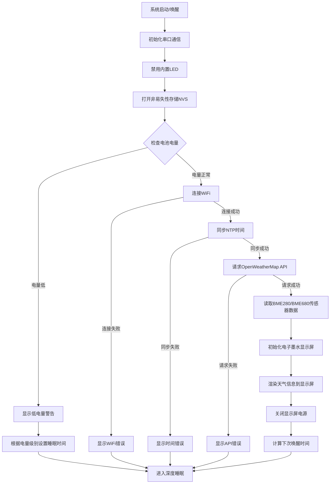
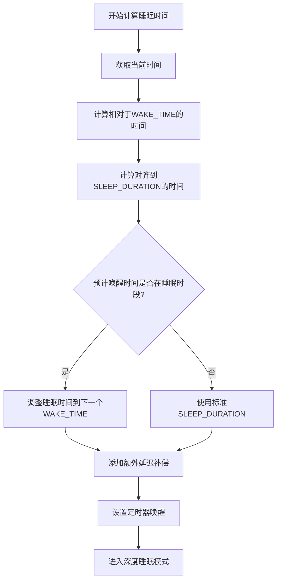
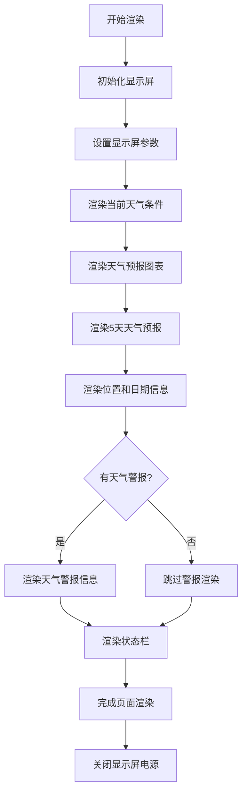
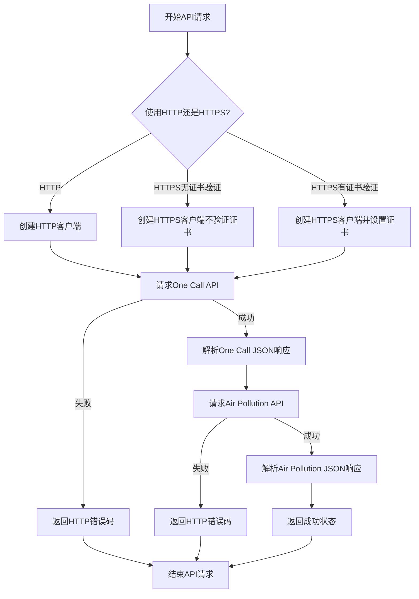
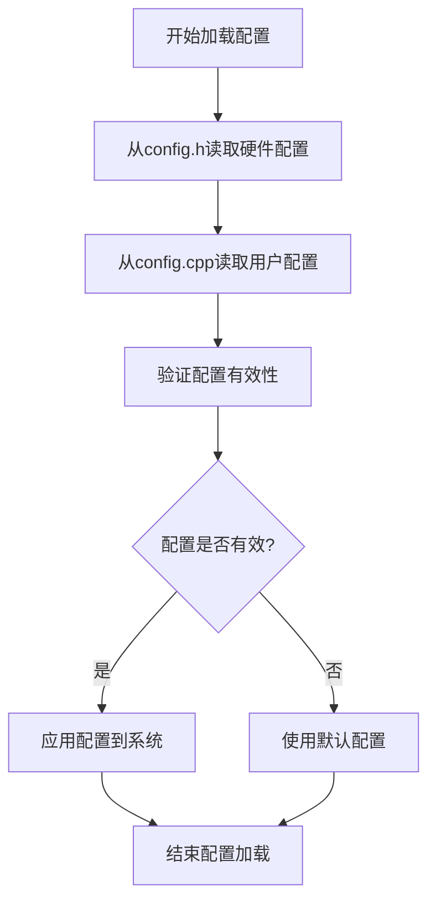
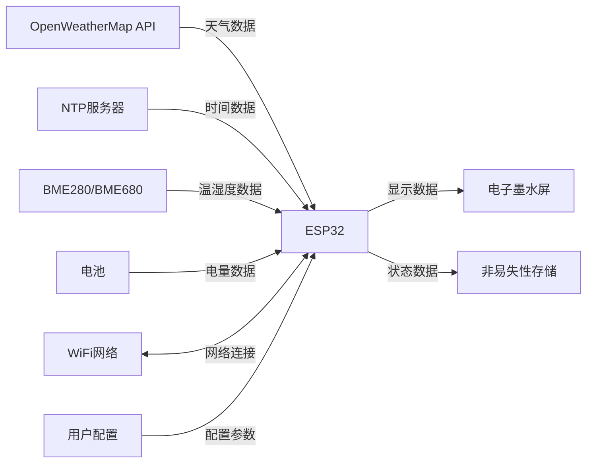
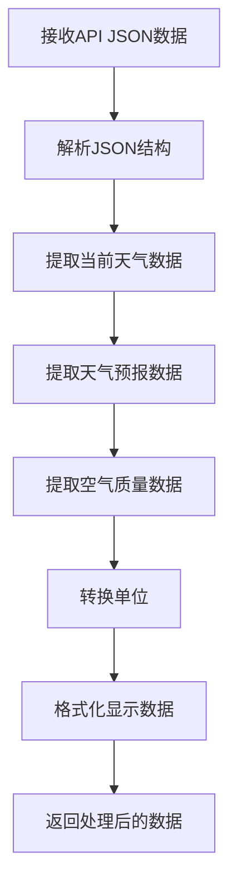

# ESP32 电子墨水屏天气显示器 - 详细流程图

## 主程序流程图



## 深度睡眠计算流程图



## 显示渲染流程图



## API数据获取流程图



## 低电量处理流程图

```mermaid
flowchart TD
    A[检测电池电压] --> B{电压 <= 低电量阈值?}
    B -->|否| C[正常操作]
    
    B -->|是| D{是首次检测到低电量?}
    D -->|是| E[在NVS中标记低电量状态]
    D -->|否| F[跳过显示更新]
    
    E --> G[显示低电量警告]
    G --> H{电压 <= 极低电量阈值?}
    F --> H
    
    H -->|是| I[进入休眠模式(需手动重置)]
    H -->|否| J{电压 <= 很低电量阈值?}
    
    J -->|是| K[设置较长睡眠间隔(120分钟)]
    J -->|否| L[设置标准低电量睡眠间隔(30分钟)]
    
    K --> M[进入深度睡眠]
    L --> M
    I --> N[结束]
    M --> N
```

## 错误处理流程图

```mermaid
flowchart TD
    A[检测错误] --> B{错误类型?}
    
    B -->|WiFi连接错误| C[显示WiFi错误图标]
    C --> D[显示"WiFi连接失败"或"SSID不可用"]
    
    B -->|API错误| E[显示API错误图标]
    E --> F[显示HTTP错误代码和描述]
    
    B -->|时间同步错误| G[显示时间错误图标]
    G --> H[显示"时间同步失败"]
    
    B -->|低电量错误| I[显示电池警告图标]
    I --> J[显示"电池电量低"]
    
    D --> K[设置下次尝试时间]
    F --> K
    H --> K
    J --> K
    
    K --> L[进入深度睡眠]
```

## 传感器数据获取流程图

```mermaid
flowchart TD
    A[开始读取传感器] --> B[设置BME电源引脚为输出]
    B --> C[打开BME电源]
    C --> D[初始化I2C通信]
    D --> E{传感器类型?}
    
    E -->|BME280| F[初始化BME280]
    E -->|BME680| G[初始化BME680]
    
    F --> H{初始化成功?}
    G --> H
    
    H -->|是| I[读取温度数据]
    H -->|否| J[记录"传感器未找到"错误]
    
    I --> K[读取湿度数据]
    K --> L{读取值是否有效?}
    
    L -->|是| M[记录成功状态]
    L -->|否| N[记录"读取失败"错误]
    
    J --> O[关闭BME电源]
    M --> O
    N --> O
    
    O --> P[结束传感器读取]
```

## 配置加载流程图



## 数据流图



## 数据处理流程图

