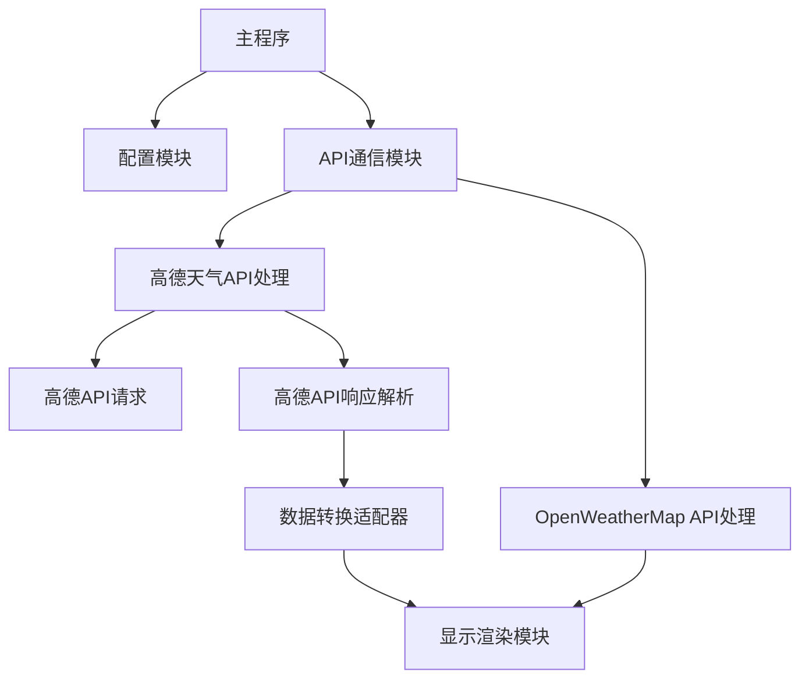
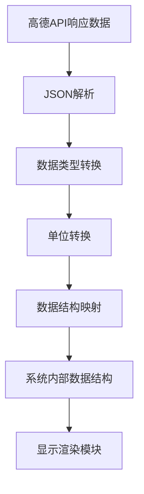

# 高德天气API集成设计文档

## 概述

本设计文档详细描述了如何将高德天气API集成到ESP32电子墨水屏天气显示器项目中。高德天气API提供了针对中国地区更准确的天气数据，包括实时天气、预报天气、生活指数和天气预警等信息。通过集成高德天气API，设备将能够为中国用户提供更准确、更本地化的天气信息，同时保持现有的用户界面布局和设计风格。

## 架构

系统将采用模块化设计，新增一个专门处理高德天气API请求和响应的模块，同时保持与现有系统的兼容性。整体架构如下：



### 核心组件

1. **配置模块**：扩展现有配置模块，添加高德API相关配置项
2. **API通信模块**：根据配置选择使用OpenWeatherMap API或高德天气API
3. **高德天气API处理模块**：
   - 高德API请求：构建和发送API请求
   - 高德API响应解析：解析JSON响应数据
   - 数据转换适配器：将高德API数据格式转换为系统内部格式
4. **显示渲染模块**：使用转换后的数据渲染电子墨水屏界面

## 组件和接口

### 1. 高德天气API处理模块 (amap_client.h/amap_client.cpp)

这个新模块将负责处理与高德天气API的通信和数据解析。

#### 主要接口

```cpp
// 初始化高德天气API客户端
bool initAmapClient();

// 获取实时天气数据
int getAmapWeatherLive(WiFiClient &client, amap_weather_live_t &weather);

// 获取天气预报数据
int getAmapWeatherForecast(WiFiClient &client, amap_weather_forecast_t &forecast);

// 获取空气质量数据
int getAmapAirQuality(WiFiClient &client, amap_air_quality_t &air);

// 获取天气预警信息
int getAmapWeatherAlert(WiFiClient &client, std::vector<amap_weather_alert_t> &alerts);

// 获取生活指数数据
int getAmapLifeIndex(WiFiClient &client, amap_life_index_t &index);
```

### 2. 高德API数据结构 (amap_response.h/amap_response.cpp)

定义高德天气API响应的数据结构，并提供JSON解析功能。

```cpp
// 实时天气数据结构
typedef struct amap_weather_live {
    String province;           // 省份名
    String city;               // 城市名
    String adcode;             // 区域编码
    String weather;            // 天气现象（汉字描述）
    String temperature;        // 实时温度（摄氏度）
    String humidity;           // 空气湿度（百分比）
    String winddirection;      // 风向描述
    String windpower;          // 风力级别
    String reporttime;         // 数据发布时间
} amap_weather_live_t;

// 天气预报数据结构
typedef struct amap_weather_forecast {
    String province;           // 省份名
    String city;               // 城市名
    String adcode;             // 区域编码
    String reporttime;         // 数据发布时间
    
    // 预报数据数组（最多3天）
    struct forecast_item {
        String date;           // 预报日期
        String week;           // 星期几
        String dayweather;     // 白天天气现象
        String nightweather;   // 晚上天气现象
        String daytemp;        // 白天温度
        String nighttemp;      // 晚上温度
        String daywind;        // 白天风向
        String nightwind;      // 晚上风向
        String daypower;       // 白天风力
        String nightpower;     // 晚上风力
    } casts[5];                // 支持5天预报
} amap_weather_forecast_t;

// 空气质量数据结构
typedef struct amap_air_quality {
    String aqi;                // 空气质量指数
    String pm25;               // PM2.5浓度
    String pm10;               // PM10浓度
    String co;                 // 一氧化碳浓度
    String no2;                // 二氧化氮浓度
    String so2;                // 二氧化硫浓度
    String o3;                 // 臭氧浓度
    String quality;            // 空气质量类别
    String primary_pollutant;  // 主要污染物
} amap_air_quality_t;

// 天气预警数据结构
typedef struct amap_weather_alert {
    String title;              // 预警标题
    String type;               // 预警类型
    String level;              // 预警等级
    String status;             // 预警状态
    String description;        // 预警详情
} amap_weather_alert_t;

// 生活指数数据结构
typedef struct amap_life_index {
    struct index_item {
        String name;           // 指数名称
        String category;       // 指数等级
        String text;           // 指数详情
    } items[8];                // 支持8种生活指数
} amap_life_index_t;

// JSON解析函数
DeserializationError deserializeAmapWeatherLive(WiFiClient &json, amap_weather_live_t &r);
DeserializationError deserializeAmapWeatherForecast(WiFiClient &json, amap_weather_forecast_t &r);
DeserializationError deserializeAmapAirQuality(WiFiClient &json, amap_air_quality_t &r);
DeserializationError deserializeAmapWeatherAlert(WiFiClient &json, std::vector<amap_weather_alert_t> &r);
DeserializationError deserializeAmapLifeIndex(WiFiClient &json, amap_life_index_t &r);
```

### 3. 数据转换适配器 (amap_adapter.h/amap_adapter.cpp)

将高德天气API的数据格式转换为系统内部使用的格式，使显示渲染模块能够无缝使用不同来源的数据。

```cpp
// 将高德实时天气数据转换为系统内部格式
void convertAmapLiveToInternal(const amap_weather_live_t &amap, owm_current_t &owm);

// 将高德天气预报数据转换为系统内部格式
void convertAmapForecastToInternal(const amap_weather_forecast_t &amap, owm_resp_onecall_t &owm);

// 将高德空气质量数据转换为系统内部格式
void convertAmapAirToInternal(const amap_air_quality_t &amap, owm_resp_air_pollution_t &owm);

// 将高德天气预警数据转换为系统内部格式
void convertAmapAlertsToInternal(const std::vector<amap_weather_alert_t> &amap, std::vector<owm_alerts_t> &owm);
```

### 4. 配置模块扩展 (config.h/config.cpp)

扩展现有配置模块，添加高德API相关配置项。

```cpp
// 高德天气API配置
#define USE_AMAP_API           // 启用高德天气API
#define AMAP_APIKEY "your_amap_api_key_here"  // 高德开放平台API密钥
#define AMAP_CITY_CODE "110101" // 城市编码（北京市）

// API源选择
// #define API_SOURCE_OWM      // 使用OpenWeatherMap API
#define API_SOURCE_AMAP        // 使用高德天气API
```

## 数据模型

### 现有显示屏数据结构

当前系统使用OpenWeatherMap API的数据结构来存储和显示天气信息。主要的数据结构如下：

#### 1. 天气基础数据结构 (owm_weather_t)

```cpp
typedef struct owm_weather
{
  int     id;               // 天气状况ID
  String  main;             // 天气参数组（雨、雪、极端天气等）
  String  description;      // 天气状况详细描述
  String  icon;             // 天气图标ID
} owm_weather_t;
```

#### 2. 温度数据结构 (owm_temp_t)

```cpp
typedef struct owm_temp
{
  float   morn;             // 早晨温度
  float   day;              // 白天温度
  float   eve;              // 傍晚温度
  float   night;            // 夜间温度
  float   min;              // 每日最低温度
  float   max;              // 每日最高温度
} owm_temp_t;
```

#### 3. 体感温度数据结构 (owm_feels_like_t)

```cpp
typedef struct owm_feels_like
{
  float   morn;             // 早晨体感温度
  float   day;              // 白天体感温度
  float   eve;              // 傍晚体感温度
  float   night;            // 夜间体感温度
} owm_owm_feels_like_t;
```

#### 4. 当前天气数据结构 (owm_current_t)

```cpp
typedef struct owm_current
{
  int64_t dt;               // 当前时间，Unix时间戳，UTC
  int64_t sunrise;          // 日出时间，Unix时间戳，UTC
  int64_t sunset;           // 日落时间，Unix时间戳，UTC
  float   temp;             // 温度
  float   feels_like;       // 体感温度
  int     pressure;         // 海平面大气压，百帕
  int     humidity;         // 湿度，百分比
  float   dew_point;        // 露点温度
  int     clouds;           // 云量，百分比
  float   uvi;              // 当前紫外线指数
  int     visibility;       // 平均能见度，米
  float   wind_speed;       // 风速
  float   wind_gust;        // 阵风风速
  int     wind_deg;         // 风向，度（气象学）
  float   rain_1h;          // 过去一小时降雨量，毫米
  float   snow_1h;          // 过去一小时降雪量，毫米
  owm_weather_t         weather;  // 天气状况
} owm_current_t;
```

#### 5. 小时预报数据结构 (owm_hourly_t)

```cpp
typedef struct owm_hourly
{
  int64_t dt;               // 预报时间，Unix时间戳，UTC
  float   temp;             // 温度
  float   feels_like;       // 体感温度
  int     pressure;         // 海平面大气压，百帕
  int     humidity;         // 湿度，百分比
  float   dew_point;        // 露点温度
  int     clouds;           // 云量，百分比
  float   uvi;              // 紫外线指数
  int     visibility;       // 平均能见度，米
  float   wind_speed;       // 风速
  float   wind_gust;        // 阵风风速
  int     wind_deg;         // 风向，度（气象学）
  float   pop;              // 降水概率，0-1
  float   rain_1h;          // 降雨量，毫米
  float   snow_1h;          // 降雪量，毫米
  owm_weather_t         weather;  // 天气状况
} owm_hourly_t;
```

#### 6. 每日预报数据结构 (owm_daily_t)

```cpp
typedef struct owm_daily
{
  int64_t dt;               // 预报时间，Unix时间戳，UTC
  int64_t sunrise;          // 日出时间，Unix时间戳，UTC
  int64_t sunset;           // 日落时间，Unix时间戳，UTC
  int64_t moonrise;         // 月出时间，Unix时间戳，UTC
  int64_t moonset;          // 月落时间，Unix时间戳，UTC
  float   moon_phase;       // 月相
  owm_temp_t            temp;       // 温度
  owm_owm_feels_like_t  feels_like; // 体感温度
  int     pressure;         // 海平面大气压，百帕
  int     humidity;         // 湿度，百分比
  float   dew_point;        // 露点温度
  int     clouds;           // 云量，百分比
  float   uvi;              // 紫外线指数
  int     visibility;       // 平均能见度，米
  float   wind_speed;       // 风速
  float   wind_gust;        // 阵风风速
  int     wind_deg;         // 风向，度（气象学）
  float   pop;              // 降水概率，0-1
  float   rain;             // 降雨量，毫米
  float   snow;             // 降雪量，毫米
  owm_weather_t         weather;    // 天气状况
} owm_daily_t;
```

#### 7. 天气预警数据结构 (owm_alerts_t)

```cpp
typedef struct owm_alerts
{
  String  sender_name;      // 预警源名称
  String  event;            // 预警事件名称
  int64_t start;            // 预警开始时间，Unix时间戳，UTC
  int64_t end;              // 预警结束时间，Unix时间戳，UTC
  String  description;      // 预警描述
  String  tags;             // 严重天气类型
} owm_alerts_t;
```

#### 8. OneCall API响应数据结构 (owm_resp_onecall_t)

```cpp
typedef struct owm_resp_onecall
{
  float   lat;              // 位置纬度
  float   lon;              // 位置经度
  String  timezone;         // 时区名称
  int     timezone_offset;  // UTC时间偏移量（秒）
  owm_current_t   current;  // 当前天气
  owm_hourly_t    hourly[OWM_NUM_HOURLY];  // 小时预报（48小时）
  owm_daily_t     daily[OWM_NUM_DAILY];    // 每日预报（8天）
  std::vector<owm_alerts_t> alerts;        // 天气预警
} owm_resp_onecall_t;
```

#### 9. 空气质量数据结构 (owm_resp_air_pollution_t)

```cpp
typedef struct owm_resp_air_pollution
{
  owm_coord_t      coord;                           // 坐标
  int              main_aqi[OWM_NUM_AIR_POLLUTION]; // 空气质量指数（1-5）
  owm_components_t components;                      // 污染物浓度
  int64_t          dt[OWM_NUM_AIR_POLLUTION];       // 数据时间，Unix时间戳，UTC
} owm_resp_air_pollution_t;
```

#### 10. 显示渲染流程

当前系统的显示渲染流程如下：

1. 初始化电子墨水显示屏
2. 渲染当前天气条件（温度、体感温度、图标）
3. 渲染天气预报图表（未来小时和天气预报）
4. 渲染5天天气预报
5. 渲染位置和日期信息
6. 渲染天气警报信息（如果有）
7. 渲染状态栏（刷新时间、WiFi信号、电池电量）
8. 完成渲染并关闭显示屏电源

渲染模块使用上述数据结构中的信息来绘制界面元素。高德天气API的数据需要转换为这些结构，以便现有的渲染模块能够无缝使用。

### 高德天气API数据模型

高德天气API提供了多个接口，每个接口返回不同类型的天气数据：

1. **实时天气接口**：返回指定城市的实时天气信息
   - 接口地址：`https://restapi.amap.com/v3/weather/weatherInfo`
   - 参数：`key`（API密钥）、`city`（城市编码）、`extensions=base`（返回实时数据）

2. **天气预报接口**：返回指定城市未来3天的天气预报
   - 接口地址：`https://restapi.amap.com/v3/weather/weatherInfo`
   - 参数：`key`（API密钥）、`city`（城市编码）、`extensions=all`（返回预报数据）

3. **空气质量接口**：返回指定城市的空气质量信息
   - 接口地址：`https://restapi.amap.com/v3/geocode/geo`（先获取经纬度）
   - 接口地址：`https://restapi.amap.com/v3/air/quality`（根据经纬度获取空气质量）
   - 参数：`key`（API密钥）、`city`（城市编码）或`location`（经纬度）

4. **天气预警接口**：返回指定城市的天气预警信息
   - 接口地址：`https://restapi.amap.com/v3/weather/weatherInfo/alarm`
   - 参数：`key`（API密钥）、`city`（城市编码）

### 数据转换映射机制

为了将高德天气API的数据无缝对接到现有的显示系统，我们需要设计一个详细的数据转换映射机制。这个机制将确保高德API返回的数据能够正确地转换为现有显示系统使用的数据结构，从而实现无需修改渲染逻辑就能显示高德天气数据。

#### 1. 数据转换适配器架构

数据转换适配器采用以下架构：



#### 2. 详细映射关系

##### 2.1 实时天气数据映射 (amap_weather_live_t → owm_current_t)

| 高德天气API字段 | 系统内部字段 | 转换方法 | 说明 |
|---------------|------------|---------|------|
| temperature | temp | String转float | 高德返回字符串格式的摄氏度温度，需转换为浮点数 |
| humidity | humidity | String转int，去掉百分号 | 高德返回带百分号的湿度值，需转换为整数 |
| winddirection | wind_deg | 风向名称转角度值 | 高德返回风向名称（如"东北风"），需转换为角度值 |
| windpower | wind_speed | 风力等级转米/秒 | 高德返回风力等级（如"3级"），需转换为米/秒 |
| weather | weather.main | 天气现象分类映射 | 根据天气现象映射到对应的天气参数组 |
| weather | weather.description | 直接使用 | 直接使用高德返回的天气现象描述 |
| weather | weather.icon | 天气现象映射到图标ID | 根据天气现象和当前时间映射到对应的图标ID |
| reporttime | dt | 时间字符串转Unix时间戳 | 高德返回的时间格式为"2023-07-22 15:30:00"，需转换为Unix时间戳 |
| N/A | sunrise | 使用日出日落API或默认值 | 高德实时天气API不返回日出时间，需从其他API获取或使用默认值 |
| N/A | sunset | 使用日出日落API或默认值 | 高德实时天气API不返回日落时间，需从其他API获取或使用默认值 |
| N/A | feels_like | 根据温度、湿度和风速计算 | 高德API不返回体感温度，需根据温度、湿度和风速计算 |
| N/A | pressure | 使用默认值或其他API | 高德实时天气API不返回气压，需从其他API获取或使用默认值 |
| N/A | dew_point | 根据温度和湿度计算 | 高德API不返回露点温度，需根据温度和湿度计算 |
| N/A | clouds | 根据天气现象估算 | 高德API不返回云量，需根据天气现象估算 |
| N/A | uvi | 使用默认值或其他API | 高德API不返回紫外线指数，需从其他API获取或使用默认值 |
| N/A | visibility | 使用默认值或其他API | 高德实时天气API不返回能见度，需从其他API获取或使用默认值 |
| N/A | wind_gust | 根据风力等级估算 | 高德API不返回阵风风速，需根据风力等级估算 |
| N/A | rain_1h | 使用默认值或其他API | 高德API不返回降雨量，需从其他API获取或使用默认值 |
| N/A | snow_1h | 使用默认值或其他API | 高德API不返回降雪量，需从其他API获取或使用默认值 |

##### 2.2 天气预报数据映射 (amap_weather_forecast_t → owm_resp_onecall_t)

| 高德天气API字段 | 系统内部字段 | 转换方法 | 说明 |
|---------------|------------|---------|------|
| casts[i].date | daily[i].dt | 日期字符串转Unix时间戳 | 高德返回的日期格式为"2023-07-22"，需转换为Unix时间戳 |
| casts[i].daytemp | daily[i].temp.day | String转float | 高德返回字符串格式的温度，需转换为浮点数 |
| casts[i].nighttemp | daily[i].temp.night | String转float | 高德返回字符串格式的温度，需转换为浮点数 |
| casts[i].daytemp | daily[i].temp.max | 使用白天温度 | 高德API不返回最高温度，使用白天温度代替 |
| casts[i].nighttemp | daily[i].temp.min | 使用夜间温度 | 高德API不返回最低温度，使用夜间温度代替 |
| N/A | daily[i].temp.morn | 估算或使用默认值 | 高德API不返回早晨温度，需估算或使用默认值 |
| N/A | daily[i].temp.eve | 估算或使用默认值 | 高德API不返回傍晚温度，需估算或使用默认值 |
| casts[i].dayweather | daily[i].weather.main | 天气现象分类映射 | 根据天气现象映射到对应的天气参数组 |
| casts[i].dayweather | daily[i].weather.description | 直接使用 | 直接使用高德返回的天气现象描述 |
| casts[i].dayweather | daily[i].weather.icon | 天气现象映射到图标ID | 根据天气现象映射到对应的图标ID |
| casts[i].daywind | daily[i].wind_deg | 风向名称转角度值 | 高德返回风向名称，需转换为角度值 |
| casts[i].daypower | daily[i].wind_speed | 风力等级转米/秒 | 高德返回风力等级，需转换为米/秒 |
| N/A | daily[i].humidity | 使用默认值或其他API | 高德预报API不返回湿度，需从其他API获取或使用默认值 |
| N/A | daily[i].pressure | 使用默认值或其他API | 高德预报API不返回气压，需从其他API获取或使用默认值 |
| N/A | daily[i].clouds | 根据天气现象估算 | 高德API不返回云量，需根据天气现象估算 |
| N/A | daily[i].pop | 根据天气现象估算 | 高德API不返回降水概率，需根据天气现象估算 |
| N/A | daily[i].rain | 使用默认值或其他API | 高德API不返回降雨量，需从其他API获取或使用默认值 |
| N/A | daily[i].snow | 使用默认值或其他API | 高德API不返回降雪量，需从其他API获取或使用默认值 |
| N/A | daily[i].feels_like | 根据温度估算 | 高德API不返回体感温度，需根据温度估算 |
| N/A | hourly[i] | 根据每日预报插值生成 | 高德API不返回小时预报，需根据每日预报插值生成 |

##### 2.3 空气质量数据映射 (amap_air_quality_t → owm_resp_air_pollution_t)

| 高德天气API字段 | 系统内部字段 | 转换方法 | 说明 |
|---------------|------------|---------|------|
| aqi | main_aqi[0] | String转int，转换为1-5等级 | 高德返回的AQI值需转换为OpenWeatherMap的1-5等级 |
| pm25 | components.pm2_5[0] | String转float | 高德返回字符串格式的PM2.5浓度，需转换为浮点数 |
| pm10 | components.pm10[0] | String转float | 高德返回字符串格式的PM10浓度，需转换为浮点数 |
| co | components.co[0] | String转float | 高德返回字符串格式的CO浓度，需转换为浮点数 |
| no2 | components.no2[0] | String转float | 高德返回字符串格式的NO2浓度，需转换为浮点数 |
| so2 | components.so2[0] | String转float | 高德返回字符串格式的SO2浓度，需转换为浮点数 |
| o3 | components.o3[0] | String转float | 高德返回字符串格式的O3浓度，需转换为浮点数 |
| N/A | components.nh3[0] | 使用默认值 | 高德API不返回NH3浓度，使用默认值 |
| N/A | dt[0] | 使用当前时间 | 高德API不返回数据时间，使用当前时间 |

##### 2.4 天气预警数据映射 (amap_weather_alert_t → owm_alerts_t)

| 高德天气API字段 | 系统内部字段 | 转换方法 | 说明 |
|---------------|------------|---------|------|
| title | event | 直接使用 | 直接使用高德返回的预警标题作为事件名称 |
| type | tags | 直接使用 | 直接使用高德返回的预警类型作为标签 |
| level | N/A | 添加到description | 将预警等级添加到描述中 |
| status | N/A | 添加到description | 将预警状态添加到描述中 |
| description | description | 直接使用 | 直接使用高德返回的预警详情 |
| N/A | sender_name | 使用"高德天气" | 高德API不返回预警源名称，使用"高德天气"作为默认值 |
| N/A | start | 使用当前时间 | 高德API不返回预警开始时间，使用当前时间 |
| N/A | end | 使用当前时间+24小时 | 高德API不返回预警结束时间，使用当前时间+24小时作为默认值 |

#### 3. 天气图标映射

高德天气API返回的天气现象需要映射到OpenWeatherMap使用的图标ID，以便显示正确的天气图标。主要映射关系如下：

| 高德天气现象 | OpenWeatherMap图标ID | 说明 |
|------------|-------------------|------|
| 晴 | 01d/01n | 晴天，根据当前时间选择白天或夜间图标 |
| 多云 | 02d/02n | 多云，根据当前时间选择白天或夜间图标 |
| 阴 | 03d/03n | 阴天，根据当前时间选择白天或夜间图标 |
| 阵雨 | 09d/09n | 阵雨，根据当前时间选择白天或夜间图标 |
| 雷阵雨 | 11d/11n | 雷阵雨，根据当前时间选择白天或夜间图标 |
| 雷阵雨伴有冰雹 | 11d/11n | 雷阵雨伴有冰雹，根据当前时间选择白天或夜间图标 |
| 小雨 | 10d/10n | 小雨，根据当前时间选择白天或夜间图标 |
| 中雨 | 10d/10n | 中雨，根据当前时间选择白天或夜间图标 |
| 大雨 | 10d/10n | 大雨，根据当前时间选择白天或夜间图标 |
| 暴雨 | 10d/10n | 暴雨，根据当前时间选择白天或夜间图标 |
| 大暴雨 | 10d/10n | 大暴雨，根据当前时间选择白天或夜间图标 |
| 特大暴雨 | 10d/10n | 特大暴雨，根据当前时间选择白天或夜间图标 |
| 阵雪 | 13d/13n | 阵雪，根据当前时间选择白天或夜间图标 |
| 小雪 | 13d/13n | 小雪，根据当前时间选择白天或夜间图标 |
| 中雪 | 13d/13n | 中雪，根据当前时间选择白天或夜间图标 |
| 大雪 | 13d/13n | 大雪，根据当前时间选择白天或夜间图标 |
| 暴雪 | 13d/13n | 暴雪，根据当前时间选择白天或夜间图标 |
| 雾 | 50d/50n | 雾，根据当前时间选择白天或夜间图标 |
| 冻雨 | 13d/13n | 冻雨，根据当前时间选择白天或夜间图标 |
| 沙尘暴 | 50d/50n | 沙尘暴，根据当前时间选择白天或夜间图标 |
| 小雨-中雨 | 10d/10n | 小雨到中雨，根据当前时间选择白天或夜间图标 |
| 中雨-大雨 | 10d/10n | 中雨到大雨，根据当前时间选择白天或夜间图标 |
| 大雨-暴雨 | 10d/10n | 大雨到暴雨，根据当前时间选择白天或夜间图标 |
| 暴雨-大暴雨 | 10d/10n | 暴雨到大暴雨，根据当前时间选择白天或夜间图标 |
| 大暴雨-特大暴雨 | 10d/10n | 大暴雨到特大暴雨，根据当前时间选择白天或夜间图标 |
| 小雪-中雪 | 13d/13n | 小雪到中雪，根据当前时间选择白天或夜间图标 |
| 中雪-大雪 | 13d/13n | 中雪到大雪，根据当前时间选择白天或夜间图标 |
| 大雪-暴雪 | 13d/13n | 大雪到暴雪，根据当前时间选择白天或夜间图标 |
| 浮尘 | 50d/50n | 浮尘，根据当前时间选择白天或夜间图标 |
| 扬沙 | 50d/50n | 扬沙，根据当前时间选择白天或夜间图标 |
| 强沙尘暴 | 50d/50n | 强沙尘暴，根据当前时间选择白天或夜间图标 |
| 霾 | 50d/50n | 霾，根据当前时间选择白天或夜间图标 |

#### 4. 风向映射

高德天气API返回的风向名称需要映射到角度值，以便正确显示风向。主要映射关系如下：

| 高德风向名称 | 角度值 | 说明 |
|------------|------|------|
| 北风 | 0 | 正北方向 |
| 东北风 | 45 | 东北方向 |
| 东风 | 90 | 正东方向 |
| 东南风 | 135 | 东南方向 |
| 南风 | 180 | 正南方向 |
| 西南风 | 225 | 西南方向 |
| 西风 | 270 | 正西方向 |
| 西北风 | 315 | 西北方向 |
| 无持续风向 | 0 | 默认使用正北方向 |

#### 5. 风力等级映射

高德天气API返回的风力等级需要映射到风速（米/秒），以便正确显示风速。主要映射关系如下：

| 高德风力等级 | 风速（米/秒） | 说明 |
|------------|-----------|------|
| 0级 | 0.0 | 无风 |
| 1级 | 0.9 | 1级风（0.3-1.5m/s） |
| 2级 | 2.4 | 2级风（1.6-3.3m/s） |
| 3级 | 4.4 | 3级风（3.4-5.4m/s） |
| 4级 | 6.7 | 4级风（5.5-7.9m/s） |
| 5级 | 9.3 | 5级风（8.0-10.7m/s） |
| 6级 | 12.3 | 6级风（10.8-13.8m/s） |
| 7级 | 15.5 | 7级风（13.9-17.1m/s） |
| 8级 | 18.9 | 8级风（17.2-20.7m/s） |
| 9级 | 22.6 | 9级风（20.8-24.4m/s） |
| 10级 | 26.5 | 10级风（24.5-28.4m/s） |
| 11级 | 30.5 | 11级风（28.5-32.6m/s） |
| 12级 | 34.8 | 12级风（32.7-36.9m/s） |
| ≥13级 | 39.0 | 13级及以上风（≥37.0m/s） |

#### 6. 空气质量指数映射

高德天气API返回的空气质量指数（AQI）需要映射到OpenWeatherMap使用的1-5等级，以便正确显示空气质量。主要映射关系如下：

| 高德AQI范围 | OpenWeatherMap等级 | 说明 |
|-----------|-----------------|------|
| 0-50 | 1 | 优，对应OpenWeatherMap的Good |
| 51-100 | 2 | 良，对应OpenWeatherMap的Fair |
| 101-150 | 3 | 轻度污染，对应OpenWeatherMap的Moderate |
| 151-200 | 4 | 中度污染，对应OpenWeatherMap的Poor |
| 201-300 | 5 | 重度污染，对应OpenWeatherMap的Very Poor |
| >300 | 5 | 严重污染，对应OpenWeatherMap的Very Poor |

#### 7. 数据补全策略

由于高德天气API和OpenWeatherMap API的数据结构存在差异，一些OpenWeatherMap API中的字段在高德天气API中没有对应的数据。为了确保显示系统能够正常工作，需要采用以下策略来补全缺失的数据：

1. **使用默认值**：对于一些不太重要的字段，可以使用合理的默认值。
2. **根据已有数据计算**：对于一些可以根据已有数据计算的字段，使用计算得到的值。
3. **使用其他API补充**：对于一些重要但高德API不提供的数据，可以使用其他API来获取。
4. **插值生成**：对于小时预报等数据，可以根据每日预报数据进行插值生成。

#### 8. 数据转换适配器实现

数据转换适配器的实现将遵循以下步骤：

1. **解析高德API响应**：使用ArduinoJson库解析高德API返回的JSON数据。
2. **数据类型转换**：将字符串格式的数值转换为对应的数值类型。
3. **单位转换**：将高德API使用的单位转换为系统内部使用的单位。
4. **数据映射**：根据上述映射关系，将高德API的数据映射到系统内部的数据结构。
5. **数据补全**：对于缺失的数据，使用上述策略进行补全。
6. **数据验证**：验证转换后的数据是否符合系统内部数据结构的要求。

## 错误处理

系统将实现完善的错误处理机制，处理以下可能的错误情况：

1. **网络连接错误**：无法连接到高德天气API服务器
   - 显示网络错误图标和错误信息
   - 记录错误日志
   - 尝试回退使用OpenWeatherMap API

2. **API请求错误**：API请求返回错误状态码
   - 显示API错误图标和错误代码
   - 记录错误日志和错误详情
   - 尝试回退使用OpenWeatherMap API

3. **JSON解析错误**：无法解析API响应的JSON数据
   - 显示数据错误图标
   - 记录错误日志和解析错误详情
   - 尝试回退使用OpenWeatherMap API

4. **数据转换错误**：数据格式不符合预期
   - 记录错误日志
   - 使用默认值或跳过显示相关数据
   - 尝试回退使用OpenWeatherMap API

## 测试策略

为确保高德天气API集成的可靠性和稳定性，将采用以下测试策略：

1. **单元测试**：
   - 测试高德API请求构建函数
   - 测试JSON解析函数
   - 测试数据转换函数

2. **集成测试**：
   - 测试高德API请求和响应处理流程
   - 测试数据转换和显示渲染流程
   - 测试错误处理和回退机制

3. **端到端测试**：
   - 测试完整的天气数据获取和显示流程
   - 测试不同配置下的系统行为
   - 测试长时间运行的稳定性

4. **边缘情况测试**：
   - 测试网络连接不稳定的情况
   - 测试API响应数据不完整的情况
   - 测试API限流或超时的情况

## 实现注意事项

1. **内存管理**：
   - 高德API响应的JSON数据可能较大，需要合理分配内存
   - 使用DynamicJsonDocument并设置足够的缓冲区大小
   - 在处理完JSON数据后及时释放内存

2. **网络请求优化**：
   - 设置合理的HTTP客户端超时时间
   - 实现请求重试机制
   - 优化请求频率，避免API限流

3. **数据缓存**：
   - 实现简单的数据缓存机制，减少API请求次数
   - 在深度睡眠前保存关键数据
   - 在唤醒后检查缓存数据的有效性

4. **兼容性**：
   - 确保系统能够无缝切换不同的API数据源
   - 保持显示渲染模块的接口不变
   - 实现合理的回退机制